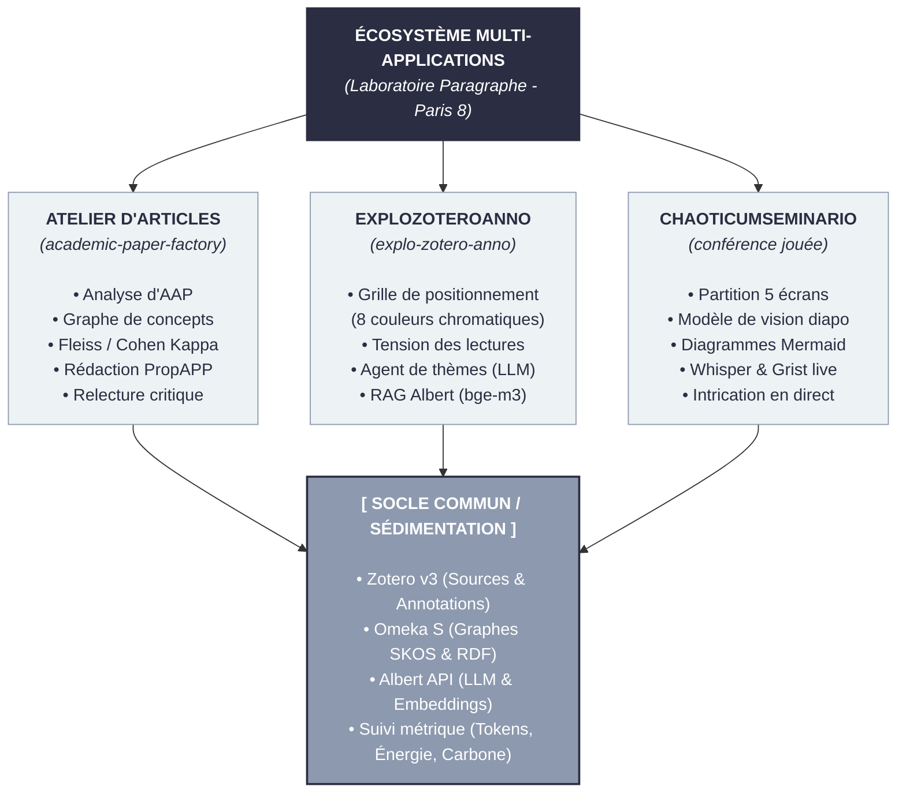

```mermaid
flowchart TD
    ECO["<b>ÉCOSYSTÈME MULTI-APPLICATIONS</b><br/><i>(Laboratoire Paragraphe - Paris 8)</i>"]

    ATELIER["<b>ATELIER D'ARTICLES</b><br/><i>(academic-paper-factory)</i><br/><br/>• Analyse d'AAP<br/>• Graphe de concepts<br/>• Fleiss / Cohen Kappa<br/>• Rédaction PropAPP<br/>• Relecture critique"]

    EXPLO["<b>EXPLOZOTEROANNO</b><br/><i>(explo-zotero-anno)</i><br/><br/>• Grille de positionnement<br/>&nbsp;&nbsp;(8 couleurs chromatiques)<br/>• Tension des lectures<br/>• Agent de thèmes (LLM)<br/>• RAG Albert (bge-m3)"]

    CHAOS["<b>CHAOTICUMSEMINARIO</b><br/><i>(conférence jouée)</i><br/><br/>• Partition 5 écrans<br/>• Modèle de vision diapo<br/>• Diagrammes Mermaid<br/>• Whisper &amp; Grist live<br/>• Intrication en direct"]

    SOCLE["<b>[ SOCLE COMMUN / SÉDIMENTATION ]</b><br/><br/>• Zotero v3 (Sources &amp; Annotations)<br/>• Omeka S (Graphes SKOS &amp; RDF)<br/>• Albert API (LLM &amp; Embeddings)<br/>• Suivi métrique (Tokens, Énergie, Carbone)"]

    ECO --> ATELIER
    ECO --> EXPLO
    ECO --> CHAOS

    ATELIER --> SOCLE
    EXPLO --> SOCLE
    CHAOS --> SOCLE

    classDef eco fill:#2b2d42,color:#ffffff,stroke:#2b2d42,stroke-width:2px;
    classDef app fill:#edf2f4,color:#2b2d42,stroke:#8d99ae,stroke-width:1px;
    classDef socle fill:#8d99ae,color:#ffffff,stroke:#2b2d42,stroke-width:2px;

    class ECO eco;
    class ATELIER,EXPLO,CHAOS app;
    class SOCLE socle;
```
