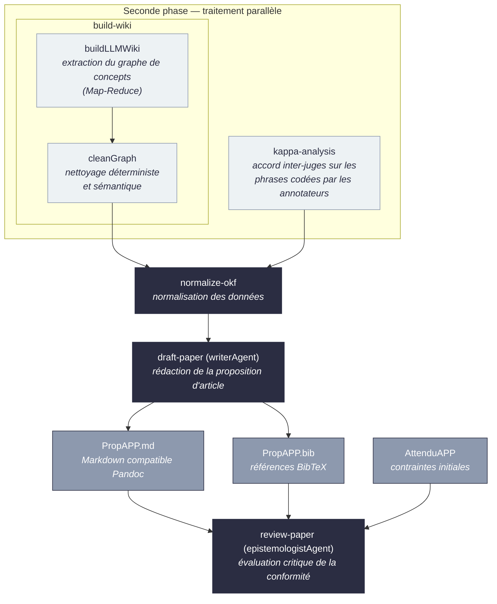

```mermaid
flowchart TD
    subgraph PHASE2["Seconde phase — traitement parallèle"]
        direction LR

        subgraph BW["build-wiki"]
            direction TB
            BW1["buildLLMWiki<br/><i>extraction du graphe de concepts<br/>(Map-Reduce)</i>"]
            BW2["cleanGraph<br/><i>nettoyage déterministe<br/>et sémantique</i>"]
            BW1 --> BW2
        end

        KA["kappa-analysis<br/><i>accord inter-juges sur les<br/>phrases codées par les annotateurs</i>"]
    end

    NORM["normalize-okf<br/><i>normalisation des données</i>"]

    DRAFT["draft-paper (writerAgent)<br/><i>rédaction de la proposition d'article</i>"]

    PROPAPP_MD["PropAPP.md<br/><i>Markdown compatible Pandoc</i>"]
    PROPAPP_BIB["PropAPP.bib<br/><i>références BibTeX</i>"]

    REVIEW["review-paper (epistemologistAgent)<br/><i>évaluation critique de la conformité</i>"]

    ATTENDU["AttenduAPP<br/><i>contraintes initiales</i>"]

    BW2 --> NORM
    KA --> NORM
    NORM --> DRAFT
    DRAFT --> PROPAPP_MD
    DRAFT --> PROPAPP_BIB
    PROPAPP_MD --> REVIEW
    PROPAPP_BIB --> REVIEW
    ATTENDU --> REVIEW

    classDef phase fill:#edf2f4,color:#2b2d42,stroke:#8d99ae,stroke-width:1px;
    classDef agent fill:#2b2d42,color:#ffffff,stroke:#2b2d42,stroke-width:2px;
    classDef data fill:#8d99ae,color:#ffffff,stroke:#2b2d42,stroke-width:1px;

    class BW1,BW2,KA phase;
    class NORM,DRAFT,REVIEW agent;
    class PROPAPP_MD,PROPAPP_BIB,ATTENDU data;
```
