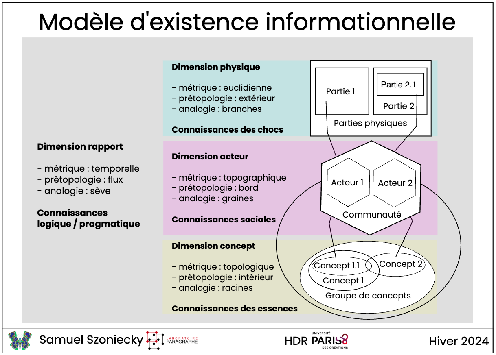

Article pour : [Ontologies et humanités numériques](https://journals.openedition.org/revuehn/5330)

# Le Tournant Ontologique dans les Humanités Numériques

## Introduction

Dans les humanités numériques et plus généralement dans les sciences humaines et sociales, la modélisation des objets d'études avec des ontologies informatiques se pratique depuis plus de quarante ans [@gruber1995] et les réflexions sur la formalisation des sciences humaines à partir de modèles mathématiques depuis bien plus longtemps encore [@petitot1978]. Dans ce contexte, le défi n'est pas principalement technique mais épistémologique [@rygiel2026]. D'autant plus à l'ère de l'intelligence artificielle générative, des « Larges Languages Models » (LLM) et des « Agents Discursifs Artificiels » (ADA) [@lakel] qui font évoluer nos pratiques scientifiques et nous font nous questionner sur les fondements théoriques de celles-ci. C'est pour alimenter les débats sur ces questions épistémologiques que nous souhaitons examiner dans cet article la thèse selon laquelle un « tournant ontologique » s'opère dans les humanités numériques comme ce qui s'observe dans l'anthropologie contemporaine. De même que des auteurs comme Philippe Descola [@descola2005] ou Bruno Latour [@latour2012] ont déconstruit les dualismes naturalistes pour intégrer pleinement les non-humains dans la composition des mondes sociaux, les chercheurs en humanités numériques repensent aujourd'hui le statut ontologique de l'artefact numérique pour lui donner le statut ontologique d'un « existant informationnel » [@morin1981, p. 340] ayant des manières d'être spécifiques dans des écosystèmes de connaissances situés [@szoniecky2024].

La communauté des chercheures et chercheurs en Humanités Numériques se trouve confrontée à une mutation épistémologique sans précédent. Il ne s'agit plus désormais de concevoir les structures de données comme de simples conteneurs ou des réceptacles passifs de l'archive, mais de les appréhender comme des environnements dynamiques doués d'une agentivité propre. Ce passage d'une vision statique de la trace à une dynamique de l'existence informationnelle marque ce que nous qualifions de « tournant ontologique ». Ce tournant, irrigué par les réflexions sur les trois écologies — environnementale, sociale et mentale — [@guattari1992], nous impose de repenser la matérialité numérique non comme un résidu, mais comme un agencement de rapports en perpétuel devenir. L'ontologie, au sens de l'ingénierie des connaissances, s'affirme ici comme le pivot d'une recherche qui cherche à modéliser les potentialités herméneutiques d'un document face aux point de vue d'actants humains et/ou numérique. En délaissant l'indexation descriptive pour une approche ontologique, nous passons d'une logique de l'inventaire à une logique de la composition. L'enjeu stratégique est de taille : il s'agit de garantir la pérennité des écosystèmes de connaissances en les dotant d'une structure capable de survivre à l'obsolescence des supports par la persistance de leurs rapports constitutifs.

Ce tournant épistémologique a notamment été initié par les recherches que nous avons menés avec Philippe Bootz dans le domaine de la poésie numérique [@bootz2008]. En nous appuyant sur l'idée deleuzienne d'une corrélation entre éthique et ontologie [@deleuze1981], nous avons élaboré un modèle où le document ou l'œuvre n'est plus une donnée inerte, mais un « individu » à part entière. Ce modèle ontologique repose sur une distinction opérante entre l'essence de l'œuvre (le plan du contenu et des concepts), ses parties extensives (le plan de l'expression, qui se modifie à travers les versions et les interactions) et les rapports instanciés par les points de vue des lecteurs, auteurs ou analystes. Cette approche a ouvert la voie à une redéfinition majeure de l'ingénierie des connaissances, postulant qu'il est possible de concevoir des « agents ontologiques » autonomes, voués à l'exploration et l'analyse des corpus documentaires pensé comme un écosystème d'information. Nous détaillerons comment cette impulsion initiale a conduit au développement d'une méthode généralisée de modélisation des « écosystèmes de connaissances » en explicitant le métamodèle onto-éthique qui structure ces milieux à partir d'existences définies par quatre dimensions existentielles corrélées à quatre genres de connaissances, quatre métriques, quatre éléments prétopologiques, quatre analogies :

{fig-align="center"}

Nous souhaitons dans cet article montrer que les activités de recherche en humanités numériques convergent aujourd'hui vers la conception pratique d'« existences informationnelles » qui prennent désormais la forme concrète d'ADA [@lakel] explorant des écosystèmes spécifiques suivant un point de vue particulier. Si l'IA connexionniste produit des modèles si complexes qu'ils échappent souvent à la compréhension humaine, son hybridation avec des modélisations symboliques (les ontologies du Web sémantique) permet de structurer une intelligence collective pilotable et interopérable. Nous illustrerons cette dynamique par des cas d'usage récents d'agents IA, à l'image du projet LITTE_BOT (chatbot génératif incarnant des figures littéraires à partir des archives de Gallica) ou du projet ExploDeleuze (prototype pour l'exploration des cours audios avec l'IA). Au sein de ces écosystèmes, les agents IA ne sont pas de simples outils de calcul, mais des entités partageant un milieu de connaissances défini par un corpus documentaire. En mobilisant le concept de « pulsation existentielle » d'Augustin Berque [@berque2009], nous modéliserons l'agentivité de ces IA selon quatre pouvoirs fondamentaux : le pouvoir de discerner (captation d'informations depuis les physicalités vers l'intériorité au travers de « cribles »), le pouvoir de raisonner (élaboration sémiotique par inférences dans l'intériorité), le pouvoir de résonance (création de rapports analogiques [@hofstadter2013] par similitudes expérientielles) et le pouvoir d'agir (expression de nouveaux documents numériques). Ce faisant, notre répondrons aux défis de ce tournant ontologique. D'une part, en représentant les subjectivités et les incertitudes inhérentes aux SHS par une coconstruction de manières d'être à partir d'un métamodèle où la connaissance est comprise comme l'expression de rapports situés entre des actants (humains et/ou numériques) et un corpus de documents. D'autre part, en pratiquant la traçabilité et l'interopérabilité des données exigée par les principes FAIR et la science ouverte par la modélisation formelle des processus de génération des connaissances et des interactions (Linked Open Data, ontologies formelles). Cet article à pour ambition de répondre aux enjeux des ontologies dans les humanités numériques par nos capacités à orchestrer une symbiose durable entre actants (acteurs humains et/ou agents IA) et environnement de connaissances. Au terme de cet article, nous nous interrogerons sur les potentialités du tournant ontologique à se transformer en spirale conique de Pappus dont la double hélice se plie et se déploie tant dans les physicalités documentaires que dans les intériorités conceptuelles comme une multitude de ressorts [@deleuze1998, [disque=4&plage=2&t=1200,1250](http://catalogue.bnf.fr/ark:/12148/cb38508098t#disque=4&plage=2&t=1200,1250)] dont la base se déplace suivant les activités des actants.

![Spirale Conique de Pappus [@ferréol2014]](images/spiraleConiquePappus.png){fig-align="center"}

#### Le Fondement Spinoziste : Modéliser l'Individu Informationnel

Pour dépasser les apories de l’indexation classique, limitée par sa nature taxonomique et statique, nous mobilisons l'ontologie de Baruch Spinoza, relue à travers le prisme deleuzien de l'expression [@deleuze2001]. Dans ce cadre, tout individu — qu'il s'agisse d'une œuvre de poésie numérique, d'un document d'archive ou d'un agent logiciel — est défini comme un "degré de puissance singulier" s'exprimant à travers une triple dimension : ses parties extensives, son essence et les rapports qui les unissent [@spinoza]. Cette approche permet de concevoir l'archive non comme un objet mort, mais comme une hécceité capable d'extension par l'incorporation d'éléments extérieurs, tels que les données de lecture ou les contextes de réception .Une distinction fondamentale doit être opérée entre l'éternité et l'immortalité de l'objet numérique [@bootz2013]. L'immortalité, quête vaine de la conservation matérielle indéfinie, se heurte à la finitude des supports (les parties extensives). À l'inverse, l'éternité réside dans l'essence de l'individu : l'œuvre numérique "meurt" techniquement lorsque le rapport entre ses parties extensives et son essence est rompu (obsolescence logicielle, perte de fichiers), mais son essence demeure une puissance d'existence prête à être réactualisée dans un nouveau rapport. Dans le champ de la poésie numérique, le contact entre le lecteur et l'œuvre s'opère par le biais du "Transitoire Observable" (TO). Le TO constitue la manifestation matérielle issue de l'exécution du code, un flux multimédia qui provoque un "choc" sensoriel chez le sujet. Ce choc engendre ce que Spinoza nomme une "connaissance inadéquate" : une perception des effets sans compréhension des causes. La transition vers une "connaissance adéquate" exige alors de remonter du choc aux rapports de composition, c'est-à-dire de comprendre comment le code (partie extensive) et l'intention (essence) s'agencent pour produire le texte-à-voir. Le tableau suivant, fondé sur le modèle (*ibid.*), synthétise cette articulation :

| Dimension | Définition Spinoziste | Application Documentaire et Humanités Numériques |
|----------------|----------------------------------------|----------------|
| **Parties Extensives** | Infinité de parties extérieures les unes aux autres (code, binaire). | **Plan de l'expression :** Code source, médias bruts, et surtout le **Transitoire Observable (TO)** comme lieu du choc sensoriel. |
| **Essence** | Degré de puissance singulier constituant l'être intérieur. | **Plan du contenu :** Concepts intrinsèques, "texte-écrit" idéal, inaccessibles directement mais constructibles par l'analyse. |
| **Rapport** | Ce qui unit les parties et exprime l'essence dans l'ici et maintenant. | **Point de vue des acteurs :** Versioning, instances de performance, rapports de lecture sémantisés (texte-à-voir/texte-auteur). |

Cette modélisation permet d'envisager l'archive comme une entité vivante : elle n'est plus un dépôt, mais un plan de consistance où les rapports peuvent être reconfigurés sans trahir l'essence de l'œuvre.

#### De l'Archive à l'Agent : Le Passage aux Agents Discursifs Artificiels (ADA)

L'évolution contemporaine des systèmes d'information, marquée par l'omniprésence de l'intelligence artificielle, laisse envisager un glissement de la modélisation de contenus vers la création d'existences informationnelles autonomes. Nous critiquons ici l'usage restrictif du terme "LLM" (Large Language Models), qui réduit l'agentivité artificielle à une simple probabilisation statistique du langage. Nous lui préférons, à la suite d'Amar Lakel [@lakel2025], les concepts de **LDM (Large Discourse Models)** et de **ADA (Agent Discursif Artificiel)**.L'ADA ne se contente pas de traiter des données ; il simule des "rapports de lecture" et incarne des métamodèles d'existences [@szoniecky2024]. Là où le LLM classique produit du texte, l'ADA structure un discours fondé sur une intentionnalité ontologique. Il agit comme un médiateur capable d'accéder aux rapports entre l'essence d'un corpus et ses manifestations matérielles. En ce sens, l'ADA est la réalisation technologique du "méta-lecteur" : une entité qui n'observe pas seulement le contenu, mais les processus de sémantisation eux-mêmes. Les caractéristiques distinctives de l'ADA sont les suivantes :

-   **Agentivité Ontologique :** L'agent n'est pas un outil extérieur, mais une partie extensive de l'écosystème qui génère ses propres rapports de sens.\
-   **Simulation de Points de Vue :** L'ADA est capable d'adopter des ontologies d'acteurs spécifiques (historien, sémioticien, lecteur naïf) pour explorer l'archive selon des axes multidimensionnels.\
-   **Sémantisation Discursive :** Contrairement à l'indexation automatisée, l'ADA produit une narration sur les données, transformant le "choc" informationnel en une composition de rapports intelligibles. Cette autonomie de l'agent discursif modifie radicalement notre rapport à l'archive : le chercheur ne dialogue plus avec une base de données, mais avec une existence artificielle capable de lui restituer la complexité des rapports constitutifs de la connaissance.

#### La Métamodélisation des Écosystèmes de Connaissances

La métamodélisation représente l'aboutissement de cette trajectoire. Il ne s'agit plus de modéliser des objets (l'ontologie de l'œuvre), mais de modéliser les processus de connaissance eux-mêmes (l'ontologie de l'analyste). En nous appuyant sur les travaux de Samuel Szoniecky [@szoniecky2024], nous définissons l'écosystème de connaissances comme un espace de simulation où l'utilisateur devient un "analyste" opérant au sein d'un environnement métamodélisé. Un apport conceptuel majeur de cette recherche est le **Théorème de l'Équichronisme Schématique** [@bootz2013]. Ce théorème permet de représenter l'évolution diachronique d'un individu informationnel (sa naissance par création de rapports, son extension par incorporation d'objets, sa mort par destruction de rapports) sur un schéma statique. En substituant l'axe temporel par des attributs de relations (date, lieu, ID), nous parvenons à schématiser la vie de l'archive sans multiplier les diagrammes. Cette innovation est cruciale pour l'IA, car elle lui permet de manipuler l'historique des connaissances comme une structure de rapports simultanés et non comme une simple chronologie linéaire. L'exploration de ces écosystèmes se structure selon les trois genres de connaissances spinozistes :

1.  **Niveau Affectif (Expérience Utilisateur) :** C'est le domaine des connaissances inadéquates, où l'utilisateur subit le choc du TO. L'interaction est dictée par l'affect et la réaction immédiate à l'interface.\
2.  **Niveau Scientifique (Composition des Rapports) :** L'analyste ou l'ADA décompose les structures de l'œuvre. On étudie ici la composition des rapports entre données, techniques et contextes (ontologies d'acteurs).\
3.  **Niveau Intuitif (Ontologie de l'Essence) :** C'est la saisie immédiate de la singularité de l'écosystème. L'utilisateur parvient à une compréhension globale de l'essence de l'œuvre à travers la multiplicité de ses versions et instances. L'utilisateur, assisté par l'ADA, navigue ainsi entre ces niveaux, transformant la lecture en une véritable ingénierie du sens.

#### 5. Conclusion : Vers une Écologie Politique de l'Information

Le passage du modèle à l'existence marque l'entrée des humanités numériques dans une ère de maturité ontologique. Nous avons démontré comment, de la poussière des données archivistiques soumises au choc sensoriel, nous pouvons remonter à une composition savante des écosystèmes via les agents discursifs artificiels. Cette trajectoire n'est pas qu'une prouesse technique ; elle est une nécessité éthique. En nous inscrivant dans la perspective des "trois écologies" [@guattari1989], nous pensons que la métamodélisation est un acte politique. Donner une existence ontologique à un objet numérique, c'est lui conférer une dignité et une place au sein de notre environnement mental et social. L'ontologie spinoziste, par sa distinction entre éternité et immortalité, offre aux Humanités Numériques un cadre robuste pour penser la survie des connaissances dans un monde de flux. Les ADA, loin d'être des substituts à l'intelligence humaine, en sont les extensions nécessaires pour habiter la complexité croissante de nos archives numériques. En définitive, le tournant ontologique nous enseigne que la connaissance n'est pas ce que l'on stocke, mais ce que l'on fait exister par la justesse de nos rapports.