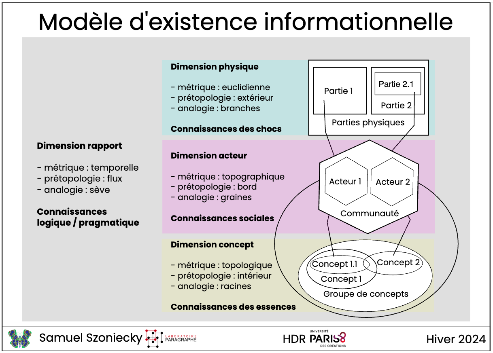

Article pour : [Ontologies et humanités numériques](https://journals.openedition.org/revuehn/5330)

# Le Tournant Ontologique dans les Humanités Numériques

## Introduction

Dans les humanités numériques et plus généralement dans les sciences humaines et sociales, la modélisation des objets d'études avec des ontologies informatiques se pratique depuis plus de quarante ans [@gruber1995] et les réflexions sur la formalisation des sciences humaines à partir de modèles mathématiques depuis bien plus longtemps encore [@petitot1978]. Dans ce contexte, le défi n'est pas principalement technique mais épistémologique [@rygiel2026]. D'autant plus à l'ère de l'intelligence artificielle générative, des « Larges Languages Models » (LLM) et des « Agents Discursifs Artificiels » (ADA) [@lakel] qui font évoluer nos pratiques scientifiques et nous font nous questionner sur les fondements théoriques de celles-ci. C'est pour alimenter les débats sur ces questions épistémologiques que nous souhaitons examiner dans cet article la thèse selon laquelle un « tournant ontologique » s'opère dans les humanités numériques comme ce qui s'observe dans l'anthropologie contemporaine. De même que des auteurs comme Philippe Descola [@descola2005] ou Bruno Latour [@latour2012] ont déconstruit les dualismes naturalistes pour intégrer pleinement les non-humains dans la composition des mondes sociaux, les chercheurs en humanités numériques repensent aujourd'hui le statut ontologique de l'artefact numérique pour lui donner le statut ontologique d'un « existant informationnel » [@morin1981, p. 340] ayant des manières d'être spécifiques dans des écosystèmes de connaissances situés [@szoniecky2024].

La communauté des chercheures et chercheurs en Humanités Numériques se trouve confrontée à une mutation épistémologique sans précédent. Il ne s'agit plus désormais de concevoir les structures de données comme de simples conteneurs ou des réceptacles passifs de l'archive, mais de les appréhender comme des environnements dynamiques doués d'une agentivité propre. Ce passage d'une vision statique de la trace à une dynamique de l'existence informationnelle marque ce que nous qualifions de « tournant ontologique ». Ce tournant, irrigué par les réflexions sur les trois écologies — environnementale, sociale et mentale — [@guattari1992], nous impose de repenser la matérialité numérique non comme un résidu, mais comme un agencement de rapports en perpétuel devenir. L'ontologie, au sens de l'ingénierie des connaissances, s'affirme ici comme le pivot d'une recherche qui cherche à modéliser les potentialités herméneutiques d'un document face aux point de vue d'actants humains et/ou numérique. En délaissant l'indexation descriptive pour une approche ontologique, nous passons d'une logique de l'inventaire à une logique de la composition. L'enjeu stratégique est de taille : il s'agit de garantir la pérennité des écosystèmes de connaissances en les dotant d'une structure capable de survivre à l'obsolescence des supports par la persistance de leurs rapports constitutifs.

Ce tournant épistémologique a notamment été initié par les recherches que nous avons menés avec Philippe Bootz dans le domaine de la poésie numérique [@bootz2008]. En nous appuyant sur l'idée deleuzienne d'une corrélation entre éthique et ontologie [@deleuze1981], nous avons élaboré un modèle où le document ou l'œuvre n'est plus une donnée inerte, mais un « individu » à part entière. Ce modèle ontologique repose sur une distinction opérante entre l'essence de l'œuvre (le plan du contenu et des concepts), ses parties extensives (le plan de l'expression, qui se modifie à travers les versions et les interactions) et les rapports instanciés par les points de vue des lecteurs, auteurs ou analystes. Cette approche a ouvert la voie à une redéfinition majeure de l'ingénierie des connaissances, postulant qu'il est possible de concevoir des « agents ontologiques » autonomes, voués à l'exploration et l'analyse des corpus documentaires pensé comme un écosystème d'information. Nous détaillerons comment cette impulsion initiale a conduit au développement d'une méthode généralisée de modélisation des « écosystèmes de connaissances » en explicitant le métamodèle onto-éthique qui structure ces milieux à partir d'existences définies par quatre dimensions existentielles corrélées à quatre genres de connaissances, quatre métriques, quatre éléments prétopologiques, quatre analogies.

Nous souhaitons dans cet article montrer que les activités de recherche en humanités numériques convergent aujourd'hui vers la conception pratique d'« existences informationnelles » qui prennent désormais la forme concrète d'ADA [@lakel] explorant des écosystèmes spécifiques suivant un point de vue particulier. Si l'IA connexionniste produit des modèles si complexes qu'ils échappent souvent à la compréhension humaine, son hybridation avec des modélisations symboliques (les ontologies du Web sémantique) permet de structurer une intelligence collective pilotable et interopérable. Nous illustrerons cette dynamique par un cas d'usage récents celui de l'environnement numérique **ExploDeleuze** : un prototype pour l'exploration des cours audios avec l'IA. Au sein de ces écosystèmes, les agents IA ne sont pas de simples outils de calcul, mais des entités partageant un milieu de connaissances défini par un corpus documentaire. En mobilisant le concept de « pulsation existentielle » d'Augustin Berque [@berque2009], nous modéliserons l'agentivité de ces IA selon quatre pouvoirs fondamentaux : le pouvoir de discerner (captation d'informations depuis les physicalités vers l'intériorité au travers de « cribles »), le pouvoir de raisonner (élaboration sémiotique par inférences dans l'intériorité), le pouvoir de résonance (création de rapports analogiques [@hofstadter2013] par similitudes expérientielles) et le pouvoir d'agir (expression de nouveaux documents numériques). Ce faisant, notre répondrons aux défis de ce tournant ontologique. D'une part, en représentant les subjectivités et les incertitudes inhérentes aux SHS par une coconstruction de manières d'être à partir d'un métamodèle où la connaissance est comprise comme l'expression de rapports situés entre des actants (humains et/ou numériques) et un corpus de documents. D'autre part, en pratiquant la traçabilité et l'interopérabilité des données exigée par les principes FAIR et la science ouverte par la modélisation formelle des processus de génération des connaissances et des interactions (Linked Open Data, ontologies formelles). Cet article à pour ambition de répondre aux enjeux des ontologies dans les humanités numériques par nos capacités à orchestrer une symbiose durable entre actants (acteurs humains et/ou agents IA) et environnement de connaissances. Au terme de cet article, nous nous interrogerons sur les potentialités du tournant ontologique à se transformer en spirale conique de Pappus dont la double hélice se plie et se déploie tant dans les physicalités documentaires que dans les intériorités conceptuelles comme une multitude de ressorts [@deleuze1998, [disque=4&plage=2&t=1200,1250](http://catalogue.bnf.fr/ark:/12148/cb38508098t#disque=4&plage=2&t=1200,1250)] dont la base se déplace suivant les activités des actants.

![Spirale Conique de Pappus [@ferréol2014]](images/spiraleConiquePappus.png){fig-align="center"}

#### Le Fondement Spinoziste : Modéliser l'Individu Informationnel

Pour dépasser les apories de l’indexation classique, limitée par sa nature taxonomique et statique, nous mobilisons l'ontologie de Baruch Spinoza, relue à travers le prisme deleuzien d'une "éthique qui soit le corrélat d'une ontologie" [@deleuze1998a,disque=12&plage=1&t=100,150]. Dans ce cadre, tout individu — qu'il s'agisse d'une œuvre de poésie numérique, d'un document d'archive ou d'un agent logiciel — est défini comme un "degré de puissance" [@deleuze_sur_1998,disque=2&plage=2&t=1550,1600] s'exprimant à travers une triple dimension : ses parties extensives, son essence et les rapports qui les unissent [@spinoza]. Cette approche permet de concevoir l'archive non comme un objet mort, mais comme une hécceité capable d'extension par l'incorporation d'éléments extérieurs, tels que les données de lecture ou les contextes de réception. De ce point de vue, une distinction fondamentale doit être opérée entre l'éternité et l'immortalité de l'objet numérique [@bootz2013]. L'immortalité, quête vaine de la conservation matérielle indéfinie, se heurte à la finitude des supports (les parties extensives). À l'inverse, l'éternité réside dans l'essence de l'individu : l'œuvre numérique "meurt" techniquement lorsque le rapport entre ses parties extensives et son essence est rompu (obsolescence logicielle, perte de fichiers), mais son essence demeure une puissance d'existence prête à être réactualisée dans un nouveau rapport. Dans le champ de la poésie numérique, le contact entre le lecteur et l'œuvre s'opère par le biais du "Transitoire Observable" (TO). Le TO constitue la manifestation matérielle issue de l'exécution du code, un flux multimédia qui provoque un "choc" sensoriel chez le sujet. Ce choc engendre ce que Spinoza nomme une "connaissance inadéquate" : une perception des effets sans compréhension des causes. La transition vers une "connaissance adéquate" exige alors de remonter du choc aux rapports de composition, c'est-à-dire de comprendre comment le code (partie extensive) et l'intention (essence) s'agencent pour produire le texte-à-voir. Le tableau suivant, fondé sur le modèle (*ibid.*), synthétise cette articulation :

| Dimension | Définition Spinoziste | Application Documentaire et Humanités Numériques |
|-------------------|----------------------------------|-------------------|
| **Parties Extensives** | Infinité de parties extérieures les unes aux autres (code, binaire). | **Plan de l'expression :** Code source, médias bruts, et surtout le **Transitoire Observable (TO)** comme lieu du choc sensoriel. |
| **Essence** | Degré de puissance singulier constituant l'être intérieur. | **Plan du contenu :** Concepts intrinsèques, "texte-écrit" idéal, inaccessibles directement mais constructibles par l'analyse. |
| **Rapport** | Ce qui unit les parties et exprime l'essence dans l'ici et maintenant. | **Point de vue des acteurs :** Versioning, instances de performance, rapports de lecture sémantisés (texte-à-voir/texte-auteur). |

Cette modélisation permet d'envisager l'archive comme une entité vivante : elle n'est plus un dépôt, mais un plan de consistance où les rapports peuvent être reconfigurés sans trahir l'essence de l'œuvre. Cette approche de l'archive modifie radicalement nos rapports aux environnements numériques : le chercheur ne dialogue plus avec une base de données, mais avec une existence informationnelle capable de lui restituer la complexité des rapports constitutifs de la connaissance dans une représentation diagrammatique [@jedrzejewski2007].

### Le Métamodèle Onto-Éthique : Modéliser les Existences Informationnelles

La métamodélisation représente une nouvelle étape du tournant ontologique des humanités numériques. Il ne s'agit plus de modéliser des objets (l'ontologie de l'œuvre), mais de modéliser les processus de connaissance eux-mêmes (l'ontologie de l'analyste). En nous appuyant sur les travaux que nous avons menés dans notre HDR [@szoniecky2024], nous définissons l'écosystème de connaissances comme un espace de simulation où le chercheur devient un "analyste" opérant au sein d'un environnement métamodélisé. Pour piloter efficacement ces écosystèmes hybrides, il est nécessaire de disposer de métamodèles capables de modéliser la complexité des interactions humains-machines. Nous proposons un métamodèle onto-éthique qui définit quatre dimensions fondamentales :

{fig-align="center"}

|  |  |  |  |
|------------------|------------------|------------------|------------------|
| Dimension | Métrique | Pré-topologie | Analogie |
| **Matérielle (Physique)** | Euclidienne | Extérieur | Branches (Connaissance des chocs) |
| **Conceptuelle (Essence)** | Topologique | Intérieur | Racines (Connaissance des essences) |
| **Sociale (Actant)** | Topographique | Bord | Graines (Dynamiques génératives) |
| **Temporelle (Rapport)** | Temporelle | Flux | Sève (Actualisation des potentiels) |

Ce métamodèle ne se contente pas de classer les données. Il permet de calculer la **complexité ontologique** de l'écosystème [@szoniecky2024, p. 90] en évaluant l'importance des dimensions qui constitue ces existences . Il donne aussi les moyens d'évaluer les **fluctuations éthiques** en calculant les intensités de pouvoirs qui affectent les existences dans leurs rapports à l'environnement [@szoniecky2026]. L'interopérabilité des données, cruciale pour les principes **FAIR** (*Findable, Accessible, Interoperable, Reusable*), est ici assurée par l'usage du Web sémantique (RDF/OWL) et des données ouvertes liées (**Linked Open Data**). Comme le souligne [@beretta2023], c'est cette sémantique robuste qui transforme les données massives en graphes de connaissances intelligibles, garantissant la traçabilité et la vérifiabilité des actions de l'agent.

## Vers un Écosystème d’Agents Discursifs Artificiels (ADA)

L’épistémologie contemporaine, sous l’impulsion de ce que Tansley et al. (2009) ont qualifié de « quatrième paradigme de la science », se trouve confrontée à une mutation radicale de ses méthodes de découverte. Ce paradigme, fondé sur l'exploration massive de données (*data-intensive discovery*), impose aux Humanités Numériques une responsabilité stratégique : celle de ne pas se réduire à une simple *datafication* ou à l’accumulation stérile de traces numériques. L’enjeu réside désormais dans le passage d’une science du signal à une science du sens, nécessitant une modélisation sémantique formelle capable de structurer l'intelligibilité du monde numérique.

L’irruption des grands modèles de langage (*Large Language Models* ou LLM) a toutefois révélé une fracture critique. Bien que performants en apparence, ces systèmes souffrent d'une opacité inhérente — la « boîte noire » — et d'une propension structurelle aux hallucinations, conséquences directes d'un fonctionnement purement statistique dénué d'ancrage ontologique. L'évolution contemporaine des systèmes d'information, marquée par l'omniprésence de l'intelligence artificielle, laisse envisager un glissement de la modélisation de contenus vers la création d'existences informationnelles autonomes. Pour préserver la rigueur scientifique, il devient impératif d'évoluer vers les concepts d'**Agent Discursif Artificiel (ADA)** et de **Large Discourse Model (LDM)** [@lakel2025]. L'ADA ne se contente pas de traiter des données ; il simule des "rapports de lecture" et incarne des métamodèles d'existences [@szoniecky2024]. Là où le LLM classique produit du texte, l'ADA structure un discours fondé sur une intentionnalité ontologique. Il agit comme un médiateur capable d'accéder aux rapports entre l'essence d'un corpus et ses manifestations matérielles. En ce sens, l'ADA est la réalisation technologique du "méta-lecteur" : une entité qui n'observe pas seulement le contenu, mais les processus de sémantisation eux-mêmes. Les caractéristiques distinctives de l'ADA sont les suivantes :

-   **Agentivité Ontologique :** L'agent n'est pas un outil extérieur, mais une partie extensive de l'écosystème qui génère ses propres rapports de sens.\
-   **Simulation de Points de Vue :** L'ADA est capable d'adopter des ontologies d'acteurs spécifiques (historien, sémioticien, lecteur naïf) pour explorer l'archive selon des axes multidimensionnels.\
-   **Sémantisation Discursive :** Contrairement à l'indexation automatisée, l'ADA produit une narration sur les données, transformant le "choc" informationnel en une composition de rapports intelligibles.

Contrairement au LLM, l'ADA est une « existence informationnelle » située, dont l'agentité est encadrée par des formalismes sémiotiques explicites. Cette mutation n'est pas seulement technique ; elle procède d'un tournant ontologique profond, irrigué par l'anthropologie de la nature et la philosophie de l'immanence, visant à redéfinir le statut des actants au sein de nos écosystèmes de connaissances. L'ADA n'est plus un moteur de calcul, mais une entité dont l'identité se construit par ses rôles et ses contacts spécifiques avec les parties extensibles de l'écosystème.

### ADA Onto-Éthique : Symbiose entre Symbolique et Connexionniste

L’émergence d’une intelligence collective durable repose sur l’union symbiotique de deux approches : le **connexionnisme** (IA statistique, volumes de données) et le **symbolique** (contraintes sémantiques, logique humaine). L'ADA Onto-Éthique incarne cette synthèse en intégrant le cycle de la sémiose [@µ2015] dans une dynamique de « pulsations existentielles » [@berque2009]. L'agentité se déploie à travers trois pouvoirs fondamentaux :

1.  **Le pouvoir de discerner (Anasémiose) :** C’est la capacité de l'agent à filtrer les données du monde physique (le flux binaire) vers son intériorité conceptuelle. Ce filtrage s'opère via des « cribles » ontologiques [@szoniecky2020] — des grilles d'analyse sémantiques qui préviennent la dérive statistique. La séquence est ici : *physique -\> crible -\> actant -\> concept*.

2.  **Le pouvoir de raisonnement et de résonance (Élaboration sémiotique) :** Dans cette phase d'intériorité (*intériorité \<-\> intériorité*), l'agent manipule des symboles selon des règles logiques. Il est crucial de distinguer le raisonnement formel de la **résonance**. Si l'ADA simule une résonance par des rapports d'analogie complexes, la véritable *Scientia Intuitiva* (vision directe des essences) demeure l'horizon de l'actant humain. L'ADA facilite cette résonance en proposant des architectures de sens où l'humain peut exercer son intuition.

3.  **Le pouvoir d'agir (Catasémiose) :** C’est l’expression de l’intériorité vers l'extérieur, transformant les pensées en nouvelles matérialités (*concept -\> actant -\> crible -\> physique*).

Le passage du LLM au **Large Discourse Model (LDM)** s'opère précisément ici : l'agent est « bridé » par un crible éthique et ontologique qui l'ancre dans un discours situé. L'ADA Onto-Éthique ne produit plus une réponse probabiliste, mais un acte de langage responsable, dont les sources et la logique sont exposées dans le graphe de connaissances.

## ExploDeleuze : exemple du Tournant Ontologique dans les Humanités Numériques

Le passage de l’archive sonore traditionnelle — en l'occurrence, les enregistrements des séminaires de Gilles Deleuze à l’Université Paris 8 [@deleuze1997] — vers un écosystème applicatif intégré, composé du module ChaoticumSeminario [@szoniecky2026a] et de la Progressive Web App (PWA) Flux Conceptuel [@explodel], ne constitue pas une simple translation de support. Il s'agit d'une mutation profonde du régime d'existence du savoir au sein des Humanités Numériques. Comme le souligne Milad Doueihi [@doueihi2011], l'humanisme numérique ne réside pas dans la technologie elle-même, mais dans la manière dont elle reconfigure nos catégories de pensée. Ici, l'archive n'est plus un dépôt statique de fichiers audio ; elle devient une « donnée vivante », un objet malléable dont l'ontologie est redéfinie par sa structure logicielle.

Les Humanités Numériques transforment la nature même du travail savant en déplaçant l'attention de l'objet vers le processus. Dans cet écosystème, le cours de Deleuze cesse d'être une unité monolithique pour devenir un agrégat de fragments, de tokens indexés et de flux sémantiques. La problématique centrale de cette évolution réside dans la dualité structurelle entre le serveur (la gestion relationnelle des données) et le client (l'expérience phénoménologique de l'utilisateur). Cette architecture participe au « tournant ontologique » en ce qu'elle ne se contente pas de représenter l'œuvre, mais lui confère une nouvelle matérialité dynamique. Ce chapitre explore comment l'interopérabilité entre les tables SQL de ChaoticumSeminario et l'interface mobile de Flux Conceptuel redéfinit l'acte d'écoute et de recherche, transformant la parole philosophique en un territoire de curation continue.

### Le Serveur comme Ontologie Structurante : Au-delà du Modèle RDF Standard

Dans la conception d'un système d'information patrimonial, l'infrastructure serveur n'est jamais un conduit neutre ; elle agit comme une ontologie structurante qui prédétermine les entités de recherche et leurs relations possibles. Lev Manovich [@manovich2014] rappelle que le logiciel « prend le commandement » des objets culturels en les soumettant à ses propres logiques de données. Pour le projet ChaoticumSeminario, le choix technique s'est porté sur une architecture hybride au sein d'Omeka-S, dépassant délibérément les limites du modèle RDF (Resource Description Framework).

Si le modèle RDF, pivot du Web Sémantique prôné par Berners-Lee [@berners-lee2006], est idéal pour établir des relations globales entre des ressources, il s'avère souvent trop rigide pour capturer la granularité et la fluidité « rhizomatique » d'un séminaire oral. L'utilisation de tables SQL dédiées pour les transcriptions et les concepts, en marge du cœur d'Omeka-S, marque une volonté de modéliser le « chaos » inhérent à la pensée deleuzienne. Johanna Drucker [@drucker2020] souligne que les interfaces de données doivent refléter l'ambiguïté des objets humanistes. Ici, la pièce maîtresse technique est la requête pivot timelineConceptAnnexe().

Cette fonction ne se limite pas à une simple extraction ; elle opère une jointure complexe entre cinq tables SQL (Conférences, Enregistrements, Fragments, Transcriptions et Concepts). Elle « reconstitue » l'objet numérique à partir de fragments atomisés. Techniquement, elle transforme le texte brut en un flux de tokens ASR (Automatic Speech Recognition) horodatés. Chaque mot devient ainsi une entité adressable, possédant sa propre existence temporelle au sein du fragment d'environ 50 secondes. Cette approche transforme la base de données en une véritable « machine à lire » [@ramsay2011], où le texte n'est plus une suite de caractères, mais un réseau de métadonnées temporelles.

Cette structure repose sur trois piliers fondamentaux :

-   L'indexation granulaire : Le découpage systématique de la parole en segments temporels précis, permettant une manipulation chirurgicale de la pensée.
-   La curation collaborative : Un modèle où la donnée n'est jamais figée, mais exposée à des ajustements constants via des contrôleurs dédiés.
-   L'intégration de services tiers : L'ouverture du système à des modèles d'IA (Whisper, Google STT) via des tâches de fond (jobs), assurant une versionnalité de la transcription.

Cette organisation logicielle crée une base de connaissances prête à être consommée. Cependant, cette structure serveur reste une potentialité abstraite tant qu'elle n'est pas réactualisée par une interface client capable de lui redonner son rythme et sa présence.

### Le Client Mobile "Flux Conceptuel" : L'Ontologie de la Présence et du Rythme

Si le serveur structure la donnée, l'interface client, représentée par la PWA Flux Conceptuel, réactualise la parole philosophique dans l'espace-temps du chercheur. Le médium numérique n'est pas seulement un vecteur, mais un cadre de compréhension qui modifie notre rapport au temps. En se connectant au point d'entrée Omeka S, l'application mobile transforme le chercheur en un acteur immergé.

L'expérience de l'écoute est alors médiée par une fonction qui aligne le texte et la parole. Cette logique est fondamentale : elle réconcilie deux régimes d'existence. D'un côté, les « tokens » bruts (la vision de la machine, une liste de mots isolés et horodatés) ; de l'autre, le « texte » (la vision humaine, ponctuée et syntaxique). En alignant ces deux flux, l'application crée un « lecteur-écouteur » : le texte prend sens au rythme de la voix, fusionnant le document sonore et sa représentation textuelle en un objet unique.

Cette présence est renforcée par le préchargement de l'application dans un cache persistant qui assure une autonomie technique. L'objet de recherche n'est plus confiné au laboratoire ; il est « territorialisé » dans le quotidien du chercheur. Le tableau suivant analyse comment ces modes d'accès redéfinissent l'interaction avec l'œuvre :

| Mode d'accès | Mécanisme technique | Agence de l'utilisateur | Dépendance technique | Impact ontologique |
|---------------|---------------|---------------|---------------|---------------|
| **Recherche Plein Texte** | cherche?trouve= (SQL MATCH) | Explorateur sémantique : l'usager déconstruit l'œuvre par concepts. | Dépendance forte à l'indexation SQL et à l'API. | L'œuvre devient une base de données conceptuelle. |
| **Lecture fragmentée** | transcriptions?idConf= | Auditeur phénoménologue : l'usager suit le flux temporel. | Dépendance au player.js et à la synchronisation ASR. | L'œuvre retrouve son rythme originel de séminaire. |
| **Contribution active** | signalerAction | Éditeur collaboratif : l'usager corrige et enrichit l'archive. | Dépendance au système d'authentification et aux ACL. | L'archive devient un écosystème ouvert et évolutif. |

Cette interface n'est donc pas un simple masque posé sur les données, mais le lieu même où s'accomplit l'expérience de la pensée, comme le suggère Bruno Latour [@latour2005] à propos de la médiation technique : l'outil ne se contente pas de transmettre, il transforme et compose l'objet qu'il donne à voir.

### La Curation Collaborative et l'IA : Vers une Ontologie Dynamique et Ouverte

L'archive numérique, dans ce paradigme, n'est jamais achevée. Elle est un processus en devenir, soutenu par une collaboration entre l'humain et la machine. Le flux de curation mis en place via l'intégration de références à Wikidata illustre cette ouverture vers le monde.

Lorsqu'un chercheur utilise l'application pour signaler une référence, il engage un processus qui dépasse le cadre du silo technique d'Omeka-S. Le lien avec Wikidata, via l'identifiant QID, permet d'inscrire l'archive de Deleuze dans le graphe universel des connaissances. Comme le prédisait Tim Berners-Lee [@berners-lee2006], le Web Sémantique prend vie lorsque les données locales se connectent à des référentiels globaux. L'entité « Deleuze » cesse d'être une simple chaîne de caractères pour devenir un nœud au sein d'un réseau de relations biographiques et bibliographiques infinies.

La « relance de transcription » (relancerAction) introduit une dimension supplémentaire : l'ontologie de la « versionnalité ». L'archive n'est plus un texte fixé une fois pour toutes, mais une série de couches successives. L'usage de modèles d'IA comme Whisper ou Google STT signifie que la « vérité » du texte est une asymptote vers laquelle on tend. La machine aide à révéler la parole, mais sous la surveillance constante de l'humain. La fonction de correction des transcriptions agit comme un filtre humain, validant les suggestions de l'IA et garantissant que l'expertise humaine reste souveraine.

Cette collaboration soulève trois enjeux majeurs :

1.  La souveraineté de l'expertise humaine : Bien que l'IA génère les tokens, c'est l'éditeur qui valide les corrections, transformant le processus de publication en une forme de « peer review » continue et collaborative.

2.  La traçabilité des sources : Chaque modification est tracée via le standard oa:motivatedBy, assurant que l'histoire de l'archive et ses altérations restent transparentes pour les futurs chercheurs.

3.  L'infinitude du réseau face à la finitude de l'outil : L'architecture permet de substituer les modèles d'IA sans compromettre la structure globale, reconnaissant que les outils de traitement sont transitoires tandis que le réseau de connaissances est permanent.

4.  Conclusion : La convergence applicative, nouveau paradigme des Humanités Numériques

Le tournant ontologique analysé à travers ChaoticumSeminario et Flux Conceptuel réside dans le passage de l'archive-objet (la cassette, le fichier audio) à l'archive-écosystème. La convergence entre le serveur et le client démontre que l'environnement numérique ne se contente pas de « contenir » la connaissance, mais qu'il la produit activement par ses interactions techniques et ses choix d'architecture.

Notre pensée évolue en symbiose avec les outils que nous créons. L'intégration future d'ADA Onto-Éthique laisse entrevoir un nouveau mode de dialogue avec l'archive : celui où le chercheur ne se contente plus de chercher des mots-clés, mais interroge directement la pensée modélisée. La matérialité numérique, loin de dématérialiser le savoir, lui offre une nouvelle profondeur, à la fois technique, éthique et philosophique. L'archive deleuzienne devient ainsi un laboratoire vivant, une architecture de l'écoute où la voix du philosophe continue de résonner, augmentée par les flux du réseau.

### Du Tournant Ontologique à la Spirale Conique de Pappus : Une Nouvelle Géométrie des Humanités Numériques

Le champ des humanités numériques traverse actuellement une mutation épistémologique profonde, qualifiée de « tournant ontologique ». Ce paradigme rompt avec la vision représentationnelle héritée du Web 2.0, où le savoir était réduit à une gestion de stocks et de métadonnées statiques. Pour le chercheur en Sciences de l’Information et de la Communication (SIC), l'enjeu n'est plus seulement d'indexer des objets, mais de modéliser des processus d’individuation psychique et collective Stiegler, 2022. Il s'agit de passer d'une informatique de la trace-archive à une intelligence des trajectoires, où le document ne se définit plus par sa position fixe dans un catalogue, mais par sa dynamique au sein d'un « milieu associé » Simondon, 1958.Le paradoxe fondamental de la cognition réside dans sa structure hétérogène : elle est à la fois cyclique — revenant sans cesse sur des concepts sédimentés pour les approfondir — et cumulative, visant une production de nouveauté. Ce mouvement, que l'on pourrait qualifier de « respiration cognitive », appelle une solution géométrique capable de résoudre la tension entre répétition et progression. La spirale conique de Pappus s’impose ici comme l'architecture de référence. Contrairement à la circularité stérile du plan, elle offre une profondeur qui définit la vitesse de sédimentation du savoir. En intégrant la dimension temporelle et l'élévation hiérarchique, elle transforme l'acte de recherche en une ascension topologique au sein de l'espace strié de la connaissance Lefebvre, 2023.

#### 2. La Géométrie de la Sédimentation Cognitive et Documentaire

Dans l'économie des savoirs contemporaine, la modélisation mathématique de l'archivage est une nécessité stratégique pour contrer l'infobésité circulaire. Pour que l'accumulation documentaire ne devienne pas un simple empilement entropique, elle doit être pensée comme un processus de sédimentation structuré. La spirale de Pappus permet de spatialiser cette sédimentation en introduisant une constante $c$ , qui régit la pente du cône et, par extension, la « technicity » du système.Mathématiquement, l’élévation de l’actant dans le savoir est pilotée par la coordonnée verticale $z$ , proportionnelle à l’angle de parcours $\\theta$ :$$z \= c \\cdot \\theta$$Dans cette équation, la constante $c$ définit la vitesse à laquelle un parcours intellectuel se transforme en strate documentaire. Plus $c$ est élevée, plus l'écart vertical entre les versions est marqué, témoignant d'une hiérarchisation rapide et d'une sédimentation vigoureuse le long de l'axe vertical (l'espace strié). À l'inverse, une constante $c$ faible suggère une maturation lente, proche de la circularité du plan horizontal. Cette abstraction trouve une matérialisation physique rigoureuse dans des dispositifs comme Omeka S. L'élévation sur l'axe $z$ ne reste pas métaphorique : elle est inscrite dans la base de données via des propriétés sémantiques précises :

-   **Matérialisation de l'élévation :** L'usage systématique de la propriété dcterms:isVersionOf permet de lier chaque nouvelle strate (souvent un récit produit en Markdown) à ses ancêtres, créant un feuilletage documentaire.\
-   **Structuration de l'archive :** Le passage d'une phase de « pli » (réflexion bidimensionnelle) à une phase de « déploiement » (montée tridimensionnelle) permet au système de retrouver son volume architectural, évitant la stagnation cognitive Rousseau, 2021.\
-   **Vitesse de sédimentation :** La constante $c$ paramètre l'effort nécessaire pour que l'innovation devienne une nouvelle couche pérenne dans l'écosystème.Cette structure garantit que l'élévation de la pensée ne se contente pas de circuler, mais qu'elle se dépose physiquement, créant un patrimoine informationnel dont la profondeur est le reflet direct de l'intensité de l'apprentissage.

#### 3. L’Algorithme de l’Hybridation : Entre Héritage et Innovation

La production de sens au sein des écosystèmes numériques repose sur l’équilibre précaire entre la fidélité aux sources et la singularité de la création. Pour modéliser ce processus, nous mobilisons le concept deleuzien de « différence et répétition » à travers un algorithme d'hybridation vectorielle Gauthier, 2021. Ce mécanisme transforme le document brut en un objet mathématique dynamique, portant en lui son propre code génétique sémantique.Le processus d'hybridation, orchestré par l'agent Mastra, se déploie en quatre étapes techniques essentielles :

1.  **Calcul de l'héritage :** On établit le barycentre vectoriel $V\_{heritage}$ des documents sources. Il représente la « gravité » des connaissances antérieures, le fond pré-individuel sur lequel s'appuie la réflexion.\
2.  **Calcul de l'innovation :** La trace nouvelle (Markdown) générée par l'agent Mastra est encodée (via le modèle BGE-m3) pour produire le vecteur $V\_{texte}$ .\
3.  **Synthèse par interpolation :** L'introduction du scalaire $\\alpha$ (le curseur de singularité) permet de pondérer l'équilibre entre les deux forces.\
4.  **Normalisation L2 :** Pour assurer la cohérence des futurs calculs de similarité au sein de la mémoire topologique, le vecteur hybride doit être ramené à une longueur unitaire.La formule finale de synthèse s'écrit comme suit :$$V\_{hybride} \= \\alpha V\_{texte} \+ (1 \- \\alpha) V\_{heritage}$$ $$V\_{final} \= \\frac{V\_{hybride}}{|V\_{hybride}|}$$Les conséquences sémantiques de la valeur de $\\alpha$ sont fondamentales pour la topologie du système. Lorsque $\\alpha$ tend vers 1, le système favorise l'innovation pure, permettant au nouveau nœud de s'affranchir de ses racines pour affirmer une singularité forte (indépendance vis-à-vis du LLM). À l'inverse, un $\\alpha$ proche de 0 maintient le document ancré dans sa matrice d'origine, privilégiant la consolidation et la répétition. Ce réglage permet au document final de résonner non seulement par ses mots-clés, mais par écho direct avec ses racines physiques Moreau, 2022.

#### 4. L’Ansatz de la Subjectivité Quantique : Vers une Trajectoire Idiosyncrasique

Pour transcender le déterminisme algorithmique des systèmes de recommandation traditionnels, il est impératif d'intégrer la subjectivité de l'actant au cœur du dispositif. L'usage d'un Ansatz quantique (circuit paramétré) permet de modéliser les « affects » spinozistes — la puissance d'agir et les inclinaisons naturelles de l'individu Chen, 2023. Cette approche refuse la *tabula rasa* : chaque acteur commence son parcours situé dans une « rétention tertiaire », c'est-à-dire le stock de connaissances déjà sédimenté.Le processus de construction d'une trajectoire idiosyncrasique suit une logique rigoureuse :

1.  **Initialisation ancrée :** Les paramètres de l'Ansatz ne sont pas aléatoires. Les angles de départ $\\theta\_i$ sont extraits de la réalité sémantique de l'archive (Omeka S) via la formule d'encodage d'amplitude : $\\theta\_i \= 2 \\arcsin(\\sqrt{W\_i})$ .\
2.  **Encodage des affects :** Par l'application de portes de rotation $R\_y(\\theta)$ , le système encode les propensions singulières de l'acteur. Ces portes représentent mathématiquement le conatus de l'apprenant, sa tendance à activer certains concepts du rhizome plutôt que d'autres.\
3.  **Association rhizomatique :** Une couche d'intrication, utilisant des portes $CX$ (CNOT), relie les concepts selon les lignes de force de l'archive, mais modulées par les résonances subjectives de l'individu.\
4.  **Optimisation COBYLA :** À chaque pulsation cognitive, les actions de l'acteur (création de liens, navigation) sont évaluées. L'algorithme d'optimisation variationnelle COBYLA ajuste alors les paramètres $\\theta$ pour affiner la topologie sur mesure de sa pensée Bernard, 2023.Cette boucle rétroactive transforme l'interface en un espace malléable où la trajectoire générée n'est plus une simple ligne statistique, mais une empreinte digitale unique de la démarche intellectuelle. On assiste ici à une véritable transduction : le passage d'une donnée froide à une expérience vécue, inscrite dans la géométrie même de la spirale Dumont, 2024.

#### 5. Morphologie de l’Apprentissage : L’Empreinte Digitale du Savoir

La visualisation tridimensionnelle de la spirale de Pappus constitue l'ultime outil d'auto-réflexion. Elle permet à l'apprenant de contempler la morphologie de son propre effort intellectuel à travers deux dynamiques majeures : la pulsation (systole/diastole) et la déformation structurelle.Au cœur de cette morphologie se trouve le concept de « Pli » (diastole conceptuelle). Lors de cette phase de résonance pure, le ressort de la spirale s'aplatit sur un plan horizontal 2D. Visuellement, la hiérarchie s'annule : c'est un moment de suspension où l'altitude $z$ devient nulle pour permettre des connexions rhizomatiques libres. À ce stade, le savoir n'est pas encore sédimenté, il est en état de vibration créatrice. Le « Déploiement » (systole topographique) survient ensuite, étirant la spirale vers le haut pour matérialiser la nouvelle strate dans l'archive physique Dubois, 2024.L'analyse de la forme finale permet de dresser une typologie contrastée de l'apprentissage :

-   **Le Cône à base large (Le saut de l'esprit) :** Cette forme traduit une intuition fulgurante. L'apprenant a réalisé un saut sémantique audacieux, connectant des domaines éloignés sans nécessairement multiplier les consultations documentaires. La largeur de la base est proportionnelle à la distance conceptuelle explorée.\
-   **La Spirale en flèche (La consolidation structurée) :** Ici, le sommet se resserre brutalement. C'est la trace d'un déplacement topographique dense mais focalisé. L'apprenant a navigué intensément au sein d'un corpus restreint pour construire une synthèse rigoureuse, privilégiant la profondeur verticale à l'évasement horizontal Vallet, 2024.Cette géométrie des humanités propose ainsi un nouvel horizon pour les interfaces de connaissances : elles ne sont plus des miroirs passifs, mais des paysages organiques témoignant, par leur propre déformation, de la vitalité et de la singularité de la pensée humaine.

#### Conclusion : Vers une Écologie Politique de l'Information

Le passage du modèle à l'existence marque l'entrée des humanités numériques dans une ère de maturité ontologique. Nous avons démontré comment, de la poussière des données archivistiques soumises au choc sensoriel, nous pouvons remonter à une composition savante des écosystèmes via les agents discursifs artificiels. Cette trajectoire n'est pas qu'une prouesse technique ; elle est une nécessité éthique. En nous inscrivant dans la perspective des "trois écologies" [@guattari1989], nous pensons que la métamodélisation est un acte politique. Donner une existence ontologique à un objet numérique, c'est lui conférer une dignité et une place au sein de notre environnement mental et social. L'ontologie spinoziste, par sa distinction entre éternité et immortalité, offre aux Humanités Numériques un cadre robuste pour penser la survie des connaissances dans un monde de flux. Les ADA, loin d'être des substituts à l'intelligence humaine, en sont les extensions nécessaires pour habiter la complexité croissante de nos archives numériques. En définitive, le tournant ontologique nous enseigne que la connaissance n'est pas ce que l'on stocke, mais ce que l'on fait exister par la justesse de nos rapports.

## Vers une Pensée Diagrammatique et une Éthique de la Discussion

Le tournant ontologique transforme radicalement la posture du chercheur, qui devient un « jardinier d'écosystèmes vivants »[@szoniecky2019]. L'objectif n'est plus l'extraction de données, mais la culture d'un milieu où l'IA et l'humain co-évoluent dans une transparence mutuelle.

Dans cette perspective, la **pensée diagrammatique** prend le pas sur la linéarité du texte. Comme le souligne Jedrzejewski [@jedrzejewski2007], le diagramme est un *topos* — un lieu topologique doué d'une vie organique — qui permet de visualiser les vecteurs de force et les flux de pouvoir. Contrairement au texte des LLM qui peut masquer sa propre vacuité sous une fluidité apparente, le diagramme expose la structure qualitative de la connaissance et oblige l'actant à se positionner de manière authentique.

L'avènement de la symbiose durable au sein du quatrième paradigme nécessite enfin une **éthique de la discussion** inspirée par [@habermas2013]. Dans cet espace partagé, l'ADA n'est plus une machine oraculaire, mais un partenaire de dialogue dont l'agentité est régulée par le bien commun. Le passage du texte au diagramme marque ainsi l'avènement d'une science où la rigueur technique du calcul se soumet à l'exigence éthique de l'intelligibilité collective.