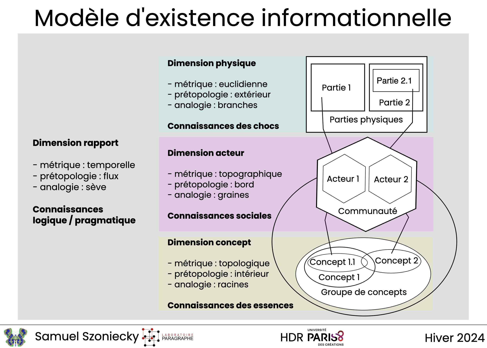
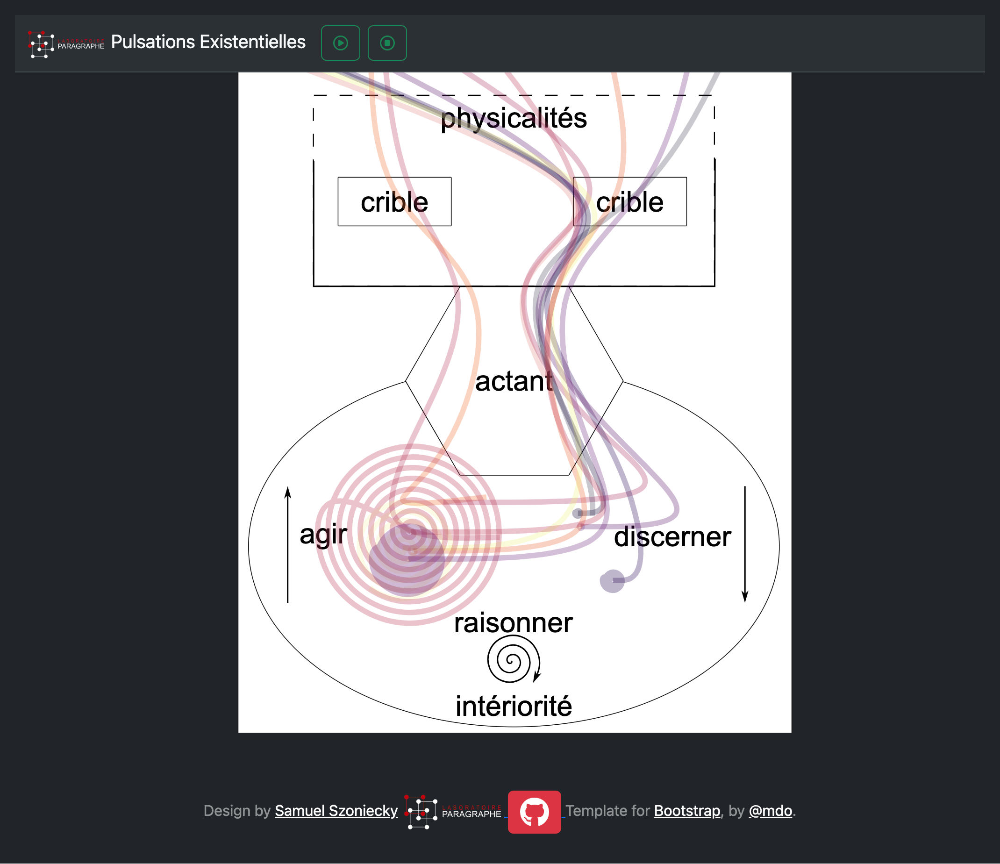
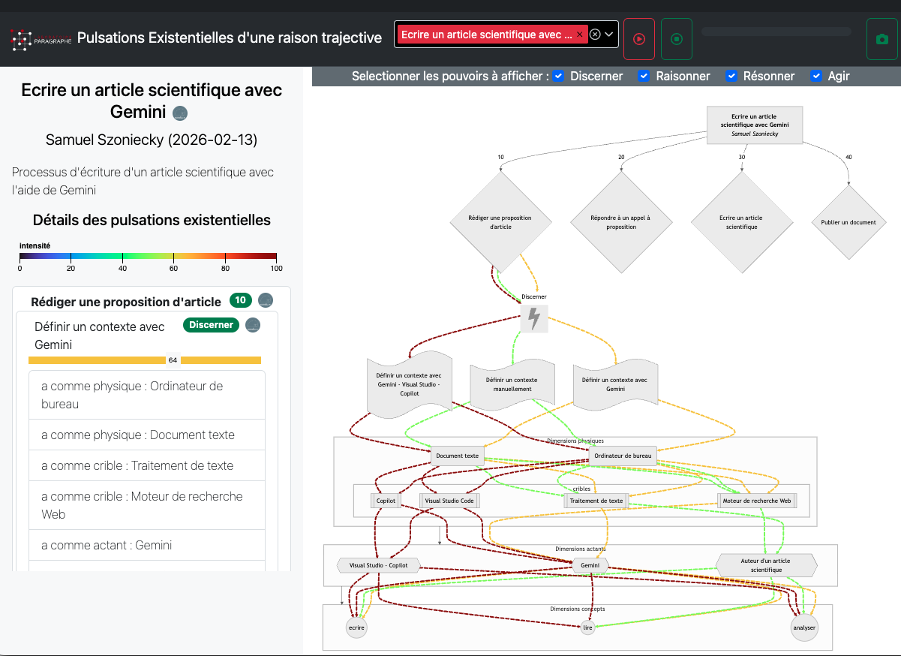

Article pour : [Le 4ème paradigme en question](https://intelligibilite-numerique.numerev.com/appels-a-articles/2921-appel-a-articles-n-7-2025)

# Du texte au diagramme : analyser la symbiose entre acteurs, agents et environnement

## Introduction

La multiplication des grands modèles de langage (LLM) et leurs usages de plus en plus nombreux placent les technologies intelligentes [@verlaet2020] au cœur des pratiques scientifiques que ce soit pour gérer la production de textes, pour calculer des modèles économiques, biologiques ou physique ou même pour gagner un prix Nobel [@mauger2025]. Ces "IAs" accentuent encore l'importance du 4ème paradigme de la science présentée par [@tansley2009] en offrant des capacités nouvelles à l’exploration des données massives qui occupe désormais une place prépondérante dans le processus de découverte scientifique. L'IA devient un consommable incontournable au même titre que le traitement de texte qui a révolutionné l'éditorialisation scientifique il y a plus de trente ans [@biezunski1989], ou le CMS (Content MAnagement System) il y a plus de vingt ans [@broudoux2005]. Aujourd'hui, ces outils numériques forment des environnements spécifiques, des milieux [@berque2009], dans lesquels nous évoluons en nous "co-développant" [@bachimont2020]. Humains et machines partagent des écosystèmes communs dont ils sont les acteurs humains [@callon2006] ou les agents numériques [@abrami2014; @balbo2018; @barkol2025]. Ils possèdent des compétences spécifiques et des manières d'être [@latour2012] qui ne sont pas toujours réciproquement profitables. D'autant moins quand on prend en compte ces environnements dans leurs dimensions géopolitiques [@saleh2024].

A la question de pourquoi le développement de ces environnements est de plus en plus rapide et global alors qu'ils ne sont pas toujours durable et profitables, mon éditeur de texte (Visual Studio Code + Copilot cf. https://visualstudio.microsoft.com/fr/github-copilot/) me propose de continuer d'écrire la suite de mon article et me propose le texte suivant :

> ### Une accélération technologique non sans conséquences

> Le développement rapide et global des environnements numériques s'explique par plusieurs facteurs. Tout d'abord, la convergence des technologies de l'information et de la communication (TIC) a permis une interconnexion sans précédent des systèmes, facilitant ainsi leur adoption à grande échelle [@castells2000]. Ensuite, la pression économique et sociale pour innover et rester compétitif pousse les acteurs à intégrer ces technologies, souvent sans évaluation approfondie de leur durabilité ou de leur impact à long terme [@schwab2017].

> Cependant, cette accélération n'est pas sans conséquences. Les infrastructures numériques consomment des ressources énergétiques et matérielles importantes, contribuant à l'épuisement des ressources naturelles et à l'augmentation des émissions de gaz à effet de serre [@bordage2019]. De plus, les inégalités d'accès et de compétences numériques creusent des écarts entre les populations, limitant les bénéfices potentiels pour certains groupes [@vandijk2019].

> Face à ces défis, il devient crucial de réfléchir à des approches qui favorisent une symbiose durable entre les acteurs humains, les agents numériques et les environnements. Cela implique de repenser les processus de conception, d'évaluation et de régulation des technologies pour qu'ils intègrent des critères de durabilité, de profitabilité et d'équité.

Je pourrais me contenter de cette réponse et après quelques vérifications de bibliographie et un peu de mise en page, passer à une autre question et ainsi de suite, paragraphe après paragraphe, écrire un article cohérent mais sans doute insipide car reflétant uniquement l'état de l'art statistique des questions abordées.

Je pourrais aussi rentrer dans les détails de cette réponse pour en faire une interprétation précise et questionner :

> " non pas la "vérité" d'une connaissance mais son "importance", non pas son contenu mais le cadrage des pratiques qui conditionnent son statut et ses utilisations possibles. " [@citton2010] p. 30

Par exemple, il est symptomatique de lire dans la conclusion que propose l'IA que "Face à ces défis" d'une "accélération technologique" la solution consiste à créer de nouvelles technologies : "Cela implique de repenser les processus de conception". Même si cette solution technophile est atténuer par des processus "d'évaluation et de régulation", l'IA ne propose pas de mettre fin à cette course à la technique. Comment l'en blâmer, qui d'un tant soit peu raisonnable, scierai la branche sur laquelle il est assis... Mais nous supposons là une conscience que cette IA serait capable de convoquer pour justifier son existence et faire en sorte qu'elle perdure. Sans rentrer dans les débats sur l'émergence effective ou non de cette conscience artificielle ou d'une IA générale (<https://fr.wikipedia.org/wiki/Intelligence_artificielle_g%C3%A9n%C3%A9rale>), retenons tout de même qu'ils posent une question éthique à trancher comme le souligne Alain Cardon :

> " le développement puis la mise en exploitation de systèmes psychiques artificiels dotés de consciences intentionnelles doivent nécessairement poser le problème des choix de leurs usages ou bien la décision justifiée de sa non-réalisation. Donc, il faut clairement poser maintenant le problème éthique de l’usage de la conscience artificielle. " [@cardon2018] p. 2

Je pourrais aussi comme le propose Marcello Vitali Rosatti décrypter les approches computationnelles mises en place par les ingénieurs qui ont conçus l'IA que j'utilise, afin de "saisir les présupposés épistémologiques, les implications politiques et culturelles, les visions du monde" [@vitalirosati2025] et ainsi estimer quelles valeurs de l'intelligence sont affirmées et dans quelles hiérarchies sociales elles me placent. C'est sans doute un travail très important a mener face à des pratiques impliquant des formalismes très complexes qu'on fait fonctionner sans questionner leurs sens comme le soulignait Miora Mugur-Schächter, il y a déjà vingt ans dans le domaine de la mécanique quantique en définissant les objectifs de la méthode de conceptualisation relativisée qui :

> " élabore un système cohérent et consensuel d'algorithmes de conceptualisation : des algorithmes de génération et développement de sens; à caractère effectif et protégés par construction de toute insertion de faux problèmes ou de paradoxes. " [@mugur-schächter2006] p. 314

Toutefois, si l'on adhère aux analyses sur le capitalisme cognitif avancé [@corteel2025], il est discutable de nous lancer dans un décryptage de technologies qui cherchent " à favoriser l’intégration des actions entraînant des gains (information) et l’évacuation des actions entraînant des pertes sur les marchés (entropie), par-delà l’échange interindividuel, au niveau de la coopération entre les cerveaux et les IA ". Il nous semble que cette stratégie de décryptage aurait comme effet d'accélérer encore d'avantage l'aliénation de " nos facultés d’invention, de création ou d’innovation " :

> " Car ce qui compte, ce n’est pas ce que j’écris, c’est l’activité cognitive que je génère dans l’échange avec l’IA ; c’est la valeur d’échange immatérielle, dont on m’exproprie en analysant mon activité cognitive. " [@corteel2025]

Je pourrais aussi partir de l'idée que " les intelligences artificielles génératives ne laissent aucune place aux activités d’expression, d’interprétation, de discussion ou de délibération " [@alombert2023] pour diagnostiquer avec raison les problèmes soulevés par ces technologies intellectuelles :

> le modèle mis en œuvre par un outil comme ChatGPT est un modèle purement consumériste, au sein duquel l’usager est réduit à une position de passeur de commande et de consommateur de contenu, privé de la possibilité de participer à la production symbolique (d’images ou de textes) car incapable de comprendre les règles qui permettent la « génération automatique » des contenus ni de remonter aux sources des opérations algorithmiques. [@alombert2023]

Relativisons cette position en replaçant par exemple se propos dans un autre contexte, celui de l'alimentation. La citation ci-dessus garde tout son sens si l'on pense aux consommateurs qui se nourrissent de plats ultra-transformés sans connaître ni la recette, ni le mode de fabrication d'un plat : ils ne participent pas " à la production symbolique " ou plutôt ils participent uniquement à la production symbolique de la marque du produit qu'il consomment. A l'opposé, les personnes qui cuisinent et mangent les légumes de leur jardin, comprennent parfaitement que la « génération automatique » des légumes n'est pas si automatique que ça et demande beaucoup d'efforts même s'ils s'aident d'un motoculteur, de produits chimiques, d'une communauté... Entre ces consommateurs et ces producteurs, il y a une multitude de relations possibles entre des aliments et leur consommation que chacun de nous composent suivant des agencements plus ou moins équilibrés : pensons à ces boites de soupes qu'Andy Warhol a transformé en œuvres d'art...

Même si dans l'article que je viens de citer, Anne Alombert émet quelques doute quand à l'usage des analogies pour comprendre et analyser un phénomène, celle que nous venons d'utiliser montre toute la complexité inhérente à la consommation d'un produit qu'il soit une carotte ou un chatbot. Au delà d'une analyse des impacts généraux de l'IA sur nos pratiques [@eddekkar2025], ce sont ces multitudes d'agencements et d'équilibres plus ou moins stables qu'il nous faut étudier pour analyser et comprendre les enjeux du quatrième paradigme de la science. Nous sommes dans un environnement complexe où les IAs deviennent indispensables à la pratique scientifique mais aussi problématique quant à leurs usages pour par exemple produire rapidement un texte sans saveur et contenant des erreurs. Entre l'interprétation critique des productions de ces IAs, le décryptage de leur présupposés épistémologiques et la construction d'automates computationnels au service de l’intelligence collective [@alombert2023], je propose dans cet article une méthode de modélisation info-communicationnelle ayant pour ambition d'évaluer la durabilité et la profitabilité réciproque, la symbiose, entre les activités intellectuelles, les agents IA et nos environnements.

Nous nous plaçons dans les perspectives de recherche qu'emprunte [@chateauraynaud] pour analyser les pouvoirs des algorithmes dans un écosystème sociotechnique. Mais au lieu de privilégier uniquement l'étude de l'environnement matériel dans lequel ils existent, nous nous intéresserons aussi aux relations qu'entretiennent ces matérialités avec nos "intériorités" [@descola2005]. Notre objectif est de définir un protocole de modélisation et d'analyse de ses relations comme le propose les recherches pour une science de la collaboration humain-IA pour la prise de décision :

> " Future research will require longitudinal field studies, shared benchmarks that evaluate collaboration processes rather than accuracy alone, and deeper investigation into how Human–AI teams evolve, adapt, and maintain alignment over time " [@gonzalez2026, p. 18]

Nous proposons une méthode pour analyser comment un individu humain ou artificiel évolue dans un son environnement et quelles répercutions cela engendre. Nous concevons ces modélisations et ces analyses comme un travail d'introspection qui cherche à révéler "l'authenticité" [@benbouzid2025] de nos pratiques, renforcer notre esprit critique [@jacquemot2025] et nous conduire à des choix éthiques [@deleuze2003a], c'est à-dire des choix dont nous sommes capables de vivre les conséquences.

Dans un premier temps, je montrerai comment modéliser des actions situées [@quéré2020] et des protocoles [@sauret2017] liés à l'écriture d'un article scientifique, afin de mesurer pour les acteurs, les agents et l'environnement, l'augmentation et la diminution de leurs pouvoirs de discernement, de raisonnement, de résonnance et d'agir [@szoniecky2020]. J'analyserai ensuite ces mesures pour évaluer des niveaux de symbiose en comparant la réciprocité et la durabilité des fluctuations de puissances.

J'expliquerai ensuite pourquoi ce travail scientifique tend vers un dépassement de la pensée textuelle au profit d'une pensée diagrammatique qui mobilise des "schémas interprétatifs" [@bachimont2020] impliquant des capacités de calcul de plus en plus grandes et une adéquation de plus en plus forte entre acteurs et agents.

Avec cet article, je souhaite orienter les réflexions sur l'intelligibilité du numérique vers une prise en compte de l'adéquation durable, profitable et réciproque entre acteurs, agents et environnement. Ce qui nous intéresse ici, c'est de poser les bases d'une discussion sur l'éthique du numérique ayant pour objectif de choisir d'exercer ou non les pouvoirs qui sont à notre disposition.

## Modéliser les pouvoirs dans les flux info-communicationnels

Il faudrait sans doute replacer les propos qui vont suivre dans un état de l'art plus consistant qui présenterait comment nous positionnons "les images de pensée" [@caraës2011] comme des cartographies [@guattari1989] issues d'une modélisation des espaces vivants [@aït-touati2019], à partir d'une esthétique orientée par les données [@drucker2020] et d'une sémiotique visuelle spécifique [@dondero2020] se basant sur une théorie de l'esprit [@plagnol2025]. Mais cela dépasserais grandement le cadre de cet article dont l'objectif principal est de donner une méthode concrète pour analyser les fluctuations de pouvoirs à partir d'une modélisation des flux info-communicationnels qui s'appuie sur les principes de modélisation et de représentation que nous avons présenté dans notre HDR [@szoniecky2024].

Pour illustrer notre utilisation de cette méthode de modélisation des communications entre acteurs et agents dans l'environnement numérique, nous prendrons un exemple en lien avec le quatrième paradigme de la science : l'écriture d'un article scientifique. Pour ce faire, nous modéliserons l'écosystème de connaissances en concevant cette pratique comme la définition d'une multitude d'états transitoires dans ce qu'on pourrait nommer une "chronotopologie" [@ferri2021]. En accord avec les principes que nous avons défini dans notre HDR [@szoniecky2024] et du méta-modèle ontoéthique qui en résulte @fig-ModeleExistenceInformationnelle, nous représentons ces successions d'états topologiques sous la forme d'une existence informationnelle dans un espace-temps donné. Nous ne détaillerons pas ici les principes théoriques et cartographiques du méta-modèle qui compose les dimensions de l’existence (physique, actant, concept, rapport) corrélées aux métriques (euclidienne, topographique, topologique, temporelle) permettant de les mesurer ; aux concepts prétopologiques (extérieur, bord, intérieur, flux) permettant de les modéliser et aux analogies (branches, graines, racines, sève) permettant de les représenter :

{#fig-ModeleExistenceInformationnelle}

Dans notre HDR, nous avons montrer que ce méta-modèle sert à calculer les complexités d'un écosystème de connaissances, comment les représenter, les explorer, les analyser et définir des objectifs existentiels. Ce qui nous importe ici c'est de montrer que ce méta-modèle sert aussi à calculer des fluctuations de puissances dont les analyses alimenteront des discussions éthiques pour déterminer collectivement : quelles puissances préserver pour atteindre quels états précis de l'écosystème ?

Pour calculer ces fluctuations de puissances, nous utilisons les principes des « pulsations existentielles » [@berque2009, p. 402] dans un cycle de sémiose [@µ2015] qui mettent en jeu successivement trois processus correspondant à trois pouvoirs : le pouvoir de discernement (anasémiose), le pouvoir de raisonnement/résonnnance (élaboration sémiotique), le pouvoir d’agir (catasémiose) cf. @fig-dynamiquesPulsationsExistentielles . Aux deux extrémités du cycle des interfaces transforment la matière en pensée (discernement) et la pensée en matière (agir), elles sont les « cribles » [@guattari1992] par lesquels passent les « pulsations existentielles » qui plongent dans l’intimité de nos élaborations et rebondissent jusqu’à la surface de nos expressions en élimant les « valeurs superflues » et en se chargeant des « valeurs importantes ». Ces cribles, Descola propose de les structurer à partir de « matrices ontologiques » [@descola2005, p. 323] qui définiront les rapports entre physicalités et intériorités. [@hofstadter2013, p. 233] nous expliquent que nous élaborons ces cribles par adoption et création d’un réseau d’analogies de plus en plus complexes. Ces auteurs venant de la sémiologie, de la géographie, de l’anthropologie, de l’intelligence artificielle et de la psychologie s’accordent pour dire qu’il est possible de modéliser ces interfaces, ces cribles, ces rapports, ces réseaux d’analogies qui vont influencer nos affects [@lordon2025] pour augmenter ou diminuer nos pouvoirs de discerner, de raisonnement/résonnnance et d'agir.

{#fig-dynamiquesPulsationsExistentielles fig-align="center" width="463"}

Nous avons développé un environnement numérique pour modéliser et représenter les fluctuations de pouvoir que produisent les pulsations existentielles. Cet environnement a été expérimenté dans le cadre d'un cours sur l'Ethique des écosystèmes numériques donné en 2025 et 2026 aux étudiants du Master 2 Analyse et Conception des Environnements Humains Numériques ([ACEHN](https://humanites-numeriques.univ-paris8.fr/-Master-ACEHN-)). Cet environnement se compose de :

-   une base de données d'objets définis par 4 classes différentes et leurs relations @fig-diagClassRaisonTrajective : des raisons trajectives, des pulsations existentielles, des pouvoirs, des temporalités.
-   une application web de gestion de ces objets et de leur visualisation sous forme de diagramme @fig-appliweb_raisontrajective

::: {#fig-diagClassRaisonTrajective}
```{mermaid}
classDiagram
class Pouvoir["Pouvoir exitentiel"] {
    +String Title
    +String Description
    +Item a comme physique
    +Item a comme crible
    +Item a comme actant
    +Item a comme concept
    +Types de pouvoir Type
    +Integer Intensité
}
class pulsationExistentielle["Pulsation exitentielle"] {
    +String Title
    +String Description
    +Item A comme pouvoir
    +Item Flux
}
class raisonTrajective["Raison trajective"] {
    +String Title
    +String Description
    +Item A comme pulsation existentielle
}
class Temporalitérelativedespulsations["Temporalité relative des pulsations"] {
    +Temporalités Temporal Coverage
    +Item A comme pulsation existentielle
}
raisonTrajective "1" --> "*" pulsationExistentielle : Ordre de la pulsation existentielle
pulsationExistentielle "0" --> "*" Temporalitérelativedespulsations : A comme flux
pulsationExistentielle "1" --> "*" Pouvoir : A comme pouvoir
Temporalitérelativedespulsations "1" --> "*" pulsationExistentielle  : A comme pulsation existentielle
```

Diagramme de classes pour la modélisation des raisons trajectives
:::

### Protocole de modélisation dans Omeka S

Nous utilisons l'application Web PHP Omeka S (https://omeka.org/s/) car elle fourni les fonctionnalités nécessaires pour mettre à disposition les données de la recherche suivant les principes FAIR (Facile à trouver, accessible, interopérable et réutilisable) (https://www.inist.fr/realisations/omeka-pour-des-bases-de-donnees-valorisees/). De plus, le développement sous la forme de modules offre une grande souplesse pour ajouter des fonctionnalités spécifiques comme la génération de diagramme, la transcription automatique, l'importation de données extérieures...

Le protocole de modélisation des pouvoirs dans les flux info-communicationnels consiste dans un premier temps à décrire les éléments qui composent les 4 dimensions existentielles d'un environnement @fig-ModeleExistenceInformationnelle, puis dans un second temps, à évaluer l'augmentation ou la diminution des pouvoirs dans les rapports qui composent une suite d'événements (raison trajective) entre les physicalités et les intériorités, entre les intériorités elles-même et entre les intériorités et les physicalités (pulsations existentielles). Par exemple, un changement d'actant dans la pulsation existentielle "consulter une page Web" induit une augmentation du pouvoir d'agir si cet actant est un adulte majeur et une diminution si c'est un enfant mineur puisque ce dernier n'est pas autorisé à voir des pages réservées aux adultes. Autre exemple, l'utilisation du crible "Inspecter" dans un navigateur Web augmente le pouvoir de discernement en montrant les structures HTML d'une page...

Nous avons résumé le protocole de modélisation en quatre étapes.

#### 1. Créer une raison trajective

Cette étape consiste à créer dans Omeka S un item en utilisant le "ressource template" (cf. [documentation](https://omeka.org/s/docs/user-manual/content/resource-template/)) : Raison trajective ([définition en json](https://acehn.jardindesconnaissances.fr/api/resource_templates/47)).

La raison trajective est définie par :

-   un nom,

-   une courte description

-   une temporalité des flux événementiels.

Créer une raison trajective consiste à organiser les événements qui se produisent dans un environnement. A la manière d'une partition musicale [@stransky2014], la raison trajective va définir les relations temporelles des événements suivant une méthode spécifique. Par exemple, dans le cas qui nous occupe à savoir "La rédaction d'un article scientifique" (<https://acehn.jardindesconnaissances.fr/s/ecosysteme_connnaissances-ecrire_article_scientifique/page/accueil>), nous définissons quatre flux dans l'environnement :

1.  Répondre à un appel à proposition,

2.  Rédiger une proposition d'article,

3.  Ecrire un article scientifique,

4.  Publier un document

Dans ce cas, la succession des flux est organisée de manière causale : il est nécessaire de faire l'action 1 avant l'action 2 etc. Toutefois on peut imaginer bien d'autre manière d'organiser la succession des flux, en utilisant par exemple la méthode de l'effectuation :

> "Causation processes take a particular effect as given and focus on selecting between means to create that effect. Effectuation processes take a set of means as given and focus on selecting between possible effects that can be created with that set of means." [@sarasvathy2001]

Quelque soit la méthode utilisée pour organiser la succession des événements ceux-ci sont modélisés par une pulsation existentielle et un ordre qui correspond à la position temporelle de l'événement dans la raison trajective.

### 2. Créer des pulsations existentielles

Dams Omeka S, cela consiste à créer un item en utilisant le "ressource template" : Pulsation existentielle ([définition en json](https://acehn.jardindesconnaissances.fr/api/resource_templates/45)).

Une pulsation existentielle est modéliser par :

-   un titre

-   une courte description

-   un ensemble de pouvoirs

-   des relations avec d'autres pulsations.

Alors que la temporalité des flux dans la raison trajective est déterminée par une succession temporelle d'états suivant une règles spécifique comme la causalité, dans les pulsations existentielles les relations entre les flux s'organisent par une temporalité relative : avant, pendant ou après. Cette gestion temporelle entre une succession des flux pour les raisons trajectives et une temporalité relatives pour des pulsations existentielles, permet de définir l'ordre des flux (raison trajective) et les liens entre flux (pulsation existentielle).

Par exemple, la pulsation existentielle "Rédiger une proposition d'article" (<https://acehn.jardindesconnaissances.fr/s/ecosysteme_connnaissances-ecrire_article_scientifique/item/64549>) est modélisée avec trois pouvoirs :

-   Définir un contexte avec Gemini

-   Définir un contexte manuellement

-   Définir un contexte avec Gemini - Visual Studio - Copilot

Cette pulsation est en relation avec une autre pulsation :

-   avant : Etre informé d'un appel à communication

Cette modélisation n'a pas pour vocation d'être exhaustive et de refléter tous les états possibles de l'environnement mais uniquement les états qui sont signifiants par rapport à une problématique spécifique. Ainsi, les trois pouvoirs que nous avons choisi, illustrent trois états possibles de la pulsation suivant que nos l'expériementons avec des IAs ou non.

### 3. Créer les pouvoirs existentielles

Pour créer un pouvoir existentiel dans Omeka S, il faut créer un item en utilisant le "ressource template" : Pouvoir existentiel ([définition en json](https://acehn.jardindesconnaissances.fr/api/resource_templates/46)).

Un pouvoir existentiel définie l'intensité d'un rapport entre des dimensions ontologiques composant une existence informationnelle @fig-ModeleExistenceInformationnelle.

L'intensité du pouvoir est définie suivant une échelle :

-   -100 = diminution extrême du pouvoir

-   0 = pas de fluctuation du pouvoir. Notons qu'il peut sembler incohérent de définir une intensité à 0 car une pulsation engendre toujours une fluctuation. D'autre part, si le pouvoir n'entraine pas de fluctuation : pourquoi le modéliser alors qu'il est insignifiant ? Toutefois, nous défendons ici la possibilité d'un point de vue subjectif : "ça ne change rien". Nous verrons plus loin comment une modélisation initiale qui reflète le point de vue du modélisateur est utile pour récolter d'autres points de vue qui eux peuvent considérer qu'un pouvoir n'apporte aucune fluctuation dans la pulsation.

-   +100 = augmentation extrême du pouvoir

Les dimensions ontologiques qui composent le rapport ne sont pas les mêmes suivant le type de pouvoir, chacun correspondant à une séquence de la pulsation physicalités \<-\> intériorités. Suivant les types de pouvoir, les rapports se composent ainsi :

-   **Pouvoir de discerner** : c'est la capacité d'un actant de percevoir les informations dans un flux événementiel physique par l'intermédiaire d'un crible afin de les conceptualiser. Nous de détaillerons pas ici la définition du crible, nous renvoyons les lecteurs curieux à [@szoniecky2024, p. 102; @szoniecky2020]. En résumé, le crible est une interface de lecture et d’écriture utilisée comme grille d’analyse d’un contexte particulier (discerner) et comme système d’expression de ce contexte (agir).

    -   séquence de la pulsation : physicalités -\> intériorités

    -   dimensions ontologiques : physique -\> crible -\> actant -\> concept.

    -   exemple : Etre informer par sa communauté <https://acehn.jardindesconnaissances.fr/s/ecosysteme_connnaissances-ecrire_article_scientifique/item/65093>

        -   physique : Paroles

        -   crible : Conférence scientifique

        -   actants : Communauté scientifique, Auteur d'un article scientifique

        -   concept : informer

-   **Pouvoir de raisonnement** : c'est la capacité d'un actant de créer des rapports formels entre concepts c'est à dire obéissant à une loi : syntaxique, institutionnelle, déontologique, essentielle.

    -   séquence de la pulsation : intériorités \<-\> intériorité

    -   dimensions ontologiques : concept (sujet) -\> concept (prédicat) -\> concept (objet)

    -   exemple :

        -   concept (sujet) : Gemini.

            Notons que dans ce pouvoir "Gemini" est considéré comme un concept et pas comme un actant. Un peu plus loin, nous verrons comment "Gemini" peut dans un autre pouvoir être considéré comme un actant.

        -   concept (prédicat) : propose

        -   concept (objet) : un texte

-   **Pouvoir de résonance** : c'est la capacité d'un actant de créer des rapports d'analogie au sens de [@hofstadter2013] et d'expérimenter des rapports intuitifs au sens de Spinoza (*Scientia Intuitiva* [@tosel1998]). Ce pouvoir ne rejette pas le pouvoir de raisonnement, mais il le traverse si vite qu'il n'en a plus besoin comme béquille. Il est « non formel » au sens où il n'est plus une manipulation de symboles ou de règles, mais une **vision directe** d'affinité, de sympathie ou d'habitude. Il conviendrait d'appronfondir cette définition en la confrontant au concept de "puissance harmonique" que propose [@plagnol2025] dans sa théorie de l'esprit.

    -   séquence de la pulsation : intériorités \<-\> intériorité

    -   dimensions ontologiques : concept (source) -\> actant -\> concept (destination).

        A la différence du pouvoir de raisonnement, l'actant est ici indispensable car le pouvoir de résonance est spécifique à l'expérience de celui-ci. Notons qu'une des hypothèses fortes que nous défendons, est que le pouvoir de résonance n'est pas accessible aux actants numériques et cela pour deux raisons. Premièrement, les actant numériques ne peuvent pas s'affranchir des rapports formels. Deuxièmement, le pouvoir de résonance en tant que connaissance des essences, passe nécessairement par l'expérimentation de l'éternité [@deleuze1998], ce dont les agents numériques sont incapables.

    -   exemple :

        -   concept (source) : importance du "close reading"

        -   actant : Samuel Szoniecky

        -   concept (destination) : importance du "close writing"

-   **Pouvoir d'agir** : définie dans le champ de la psychologie du travail, de l’ergonomie [@gouédard2012] et de l'analyse de l'activité [@brun2017], le pouvoir d'agir est utilisé ici pour expliciter la passage entre les intériorités et les physicalités par un actant « situé dans un rapport singulier au monde réel, rapport qui actualise et réalise la capacité d’agir en transformant les potentialités en pouvoir. » [@gouédard2012, § 9] Cette transformation des pensées en matières par un actant [@szoniecky2024, p. 102] passe aussi par la médiation des cribles [@szoniecky2024, p.144] qui

    > « constituent en interface entre 1) les virtualités virulentes du chaos, les proliférations stochastiques et 2) les potentialités actuelles dûment répertoriables et consolidables. » [@guattari1992, p. 140]

    -   séquence de la pulsation : intériorités -\> physicalités

    -   dimensions ontologiques : concept -\> actant -\> cribles -\> physiques.

    -   exemple :

        -   concept : écrire

        -   actant : Samuel Szoniecky

        -   cribles : clavier d'ordinateur

### 4. Créer les rapports entre raisons, pulsations et pouvoirs

Une des fonctions très utiles d'Omeka S consiste à donner comme valeur d'une propriété une ou plusieurs ressources (item, collection, media) présentent dans la base de données. Ainsi, il est possible de créer des réseaux d'objets à partir d'un triplet RDF : sujet = une ressource -\> prédicat = une propriété de la ressource -\> objet = une ou plusieurs ressources.

Dans le protocole que nous proposons chaque classe d'objet est reliée aux autres par des propriétés spécifiques comme le décrit le diagramme de classe @fig-diagClassRaisonTrajective en précisant le type "item" pour les propriétés concernées :

-   dans une item Raison trajective, ajouter les items Pulsation existentielle

-   dans une item Pulsation existentielle, ajouter les items Pouvoir existentiel

-   dans une item Pouvoir existentiel ajouter les items des dimensions ontologiques liées à ce pouvoir cf. ci-dessus.

Pour faciliter la saisie de ce réseau complexe d'objet nous avons modélisé des "resources templates" qui précisent les propriétés de chaque classe d'objets et le type de valeur attendue pour chaque propriété. Toutefois, la multiplication des objets et de leurs relations rend difficile leur création, leur vérification et leur maintenance à partir de l'interface d'administration d'Omeka S. Nous avons donc développer un outils pour vérifier le réseau d'objet et le représenter sous forme de diagramme.

### 5. Vérifier la modélisation

Nous avons conçu et développé un outil ([code source](https://github.com/samszo/pulsationsExistentielles)) pour afficher et vérifier le travail de modélisation des raisons trajectives que les étudiants ont fait. Il est accessible à la page : https://acehn.jardindesconnaissances.fr/pulsationsExistentielles/index.html.

Pour commencer la vérification, il faut choisir la raison trajective dans la liste déroulante du haut de la page. Par exemple : ACEHN -\> Samuel Szoniecky -\> Ecrire un article scientifique

L'application récupére les données de cette raison trajective via l'API d'Omeka S et affiche (voir ci-dessous @fig-appliweb_raisontrajective ) : - sur la gauche les détails de ces données et les erreurs éventuelles, - sur la droite la représentation de cette raison trajective sous la forme d'un diagramme Mermaid (cf. [documentation](https://mermaid.js.org/))

{#fig-appliweb_raisontrajective}

Cette application propose des fonctionnalités très utiles pour observer les modélisations mais il reste encore beaucoup à faire pour qu'elle soit pleinement opérationnelle cf. \@#design-new-tool. Notamment pour analyser les fluctuations de puissances.

### 6. Analyser les fluctuations de puissances

La première ambition de ce travail était d'utiliser le protocole que nous avons décrit ci-dessus pour évaluer la symbiose entre acteurs, agents et environnement afin de participer aux recherches en cours sur cette question notamment pour quantifier les synergie entre humains et AI [@riedl] ou pour mesurer la capacité décisionnelle des individus [@suarez2025]. Malheureusement, nous n'avons pas mener ce projet en totalité faute de temps et de ressource. La complexité du processus de modélisation qui est nécessaire pour décrire précisément les fluctuations de puissances demande beaucoup de temps et nous ne pouvions pas mobiliser les étudiants pour faire ce travail que seul un chercheur est en capacité de faire. Toutefois, ce travail de conception du protocole et de développement de l'outil associé, nous apporte des indications sur la manière de procéder à ces analyses en développant :

> « des infrastructures \[…\] destinées à faciliter les processus d’interprétation, de délibération et de prise de décision collective » [@stiegler2020] cité par [@alombert2023]

L'objectif que nous poursuivons est celui « du perfectionnement des processus d’enquête et de la dissémination de leurs conclusions » [@ogien2014] en fournissant des dispositifs numériques permettant à chacun de se positionner dans un débat collectif complexe. Ainsi, la modélisation d'une raison trajective crée le contexte d'une « action partagée » \[Ibid.\] à partir de laquelle les individus pourront se positionner. Autrement dit, la modélisation d'une raison trajective est pour le chercheur un moyen de décrire très précisément une hypothèse afin de la soumettre à différents actant ayant chacun leur propre "mode d'existence" [@latour2012]. Suivant le rôle de ces actant, Ils pourront se positionner en :

-   évaluant l'augmentation ou la diminution de leurs pouvoirs dans ce contexte

-   modifiant les dimensions ontologiques qui composent les pouvoirs

-   créant de nouvelles pulsations existentielles et raisons trajectives.

Dès lors, il devient possible de mesurer les fluctuations de puissances entre une hypothèse initiale et ces modifications. Ce positionnement initiale exprime le point de vue particulier du modélisateur en tant qu'individu mais il peut aussi être la simulation des positionnements d'actants ayant des modes d'existences spécifiques. C'est notamment l'ambition que nous avions dans ce projet de recherche en positionnant dans une même raison trajective, celle de l'écriture d'un article scientifique, mon point de vue en tant que chercheur, celui d'un dispositif d'IA comme Gemini et celui de l'environnement en tant individu ayant ses propres manières d'être [@latour2015].


### Concevoir et développer un nouvel outil de modélisation des écosystèmes de connaissances {#design-new-tool}

Les expériences que nous avons menées avec les étudiants du [Master 2 ACEHN](https://humanites-numeriques.univ-paris8.fr/-Master-ACEHN-) nous ont montré que les difficultés à comprendre le travail de modélisation pouvaient être atténuées par plusieurs types de médiations. Premièrement, une médiation humaine pour expliquer oralement ce que sont les écosystèmes de connaissances et comment en évaluer l'éthique ; suivi de discussions argumentés par des lectures sur le ce sujet. Deuxièmement, une médiation par des travaux dirigés basés sur un [protocole écrit](https://github.com/Humanites-Numeriques-Universite-Paris-8/ACEHN_25-26/blob/main/ProtocolePulsationExistentielle.md) et réalisé concrètement dans l'environnement numérique dédié à ce travail (Omeka S). Troisièmement, une vérification du travail via l'interface de cartographie @fig-diagClassRaisonTrajective accompagné de discussions sur l'interprétation des diagrammes. Enfin, une réflexion sur les améliorations à apporter au protocole et aux outils permettant de le réaliser qui a été formalisée dans GitHub sous la forme d'[issues](https://github.com/samszo/pulsationsExistentielles/issues).

Il résulte de ces expérimentations que nous avons besoin de concevoir et de développer un nouvel outil de modélisation des écosystèmes de connaissances basé sur celui qui existe et en y intégrant un module spécifique dédié à l'analyse des fluctuations de pouvoirs et en prenant en compte les corrections et les améliorations exprimées par les étudiants. Nous espérons mener à bien ce projet d'ici février 2027 pour continuer ces expérimentations avec la nouvelle promotion des étudiants ACEHN. Cet article est aussi l'occasion de mobiliser d'autres personnes qui seraient intéressées par la conception, le développement ou l'utilisation d'un tel outil.

Quoi qu'en disent certains [@masi], une communication entre les machines et les humains par du texte dans un terminal n'est pas tout ce dont nous avons besoin, même si cette tendance s'affirme dans de nombreux projet comme [fabric](https://github.com/danielmiessler/fabric) en réaction à la tendance des plateformes uniquement graphiques comme [Notebooklm](https://notebooklm.google.com/) ou à la multiplication des interfaces vocales initié par ChatGPT. Le travail de modélisation que nous venons de présenter, illustre bien la nécessité d'utiliser des abstractions graphiques pour comprendre la complexité des connaissances à gérer et la cohérence des multiplies tâches à effectuer. En guise de conclusion, nous insisterons sur l'importance de penser les communications hommes \<-\> machines autrement que par le texte uniquement en présentant une réflexion épistémiques sur les enjeux du passage du texte au diagramme dans le contexte des sciences pilotée par les données.

## Du texte au diagramme

La lecture et l'écriture de textes sont les bases du travail scientifique. Cependant, on observe une importance grandissante des diagrammes notamment dans les thèses où l'on trouve de plus en plus de représentations graphiques même dans les disciplines de sciences humaines et sociales. La démocratisation des outils de dessin vectoriel et l'émergence de plateforme facilitant la production de dataviz [@louâpre2017] ont sans doute contribué au développement de ces expressions graphiques et spatiales qui pour David Rabouin sont au cœur du discours scientifique :

> "Les écritures symboliques qui parsèment désormais n'importe quel écrit scientifique, ne sont d'ailleurs \[...\] qu'un prolongement de ces représentations spatiales." [@rabouin2010] p. 42

L'importance de ces diagrammes se manifeste par des recherches spécifiques ([@jedrzejewski2007; @iafrate2015; @voss2019; @batt2005a; @battistini2004]) qui prennent aujourd'hui la forme d'une "diagrammatologie" pour "rendre visibles les vecteurs de forces tels qu’ils s’opposent et s’entremêlent dans la formation des formes." [@dahan-gaida2023] ou d'une "ingénierie sémiotique des systèmes diagrammatiques" [@ferri2020] qui a pour vocation de modéliser : "les opérations qui excèdent toute formalisation algorithmique".

La présence des diagrammes dans les discours scientifique reflète la volonté des chercheurs de communiquer des informations autrement que par le texte :

> " Alors que les symboles signifient, les diagrammes se caractérisent par leur générativité, leur capacité à produire autre chose que ce qu’ils représentent. Ils ne sont pas de simples instruments d’expression de la pensée mais participent à la production de la connaissance. Ce sont des inscriptions matérielles dotées d’un sens qui conserve des traces non verbales. " [@dahan-gaida2023]

Le texte et le diagramme se différencient d'une part par leurs formes graphiques, l'une basée sur une succession linéaire de chaînes de caractères issues d'un alphabet et l'autre construite à partir d'un vocabulaire graphique plus global : points, lignes, plans. La différence se fait d'autre part sur l'activité cognitive que ces deux formes génèrent, l'une basée sur une construction linéaire du sens caractères après caractères, mots après mots... l'autre basée sur une compréhension :

> " qui ne se saisit pas par une succession d’inférences logiques, mais globalement, intuitivement, dans une dimension intellectuelle et corporelle qui passe par le geste. " [@jedrzejewski2007] p. 184

Cette communication spécifique du diagramme s'opère par un double pouvoir : " puissance de modélisation et pouvoir de générativité, il permet de comprendre les dynamiques d’émergence et de transformation des formes et de la pensée " [@dahan-gaida2023].

Dans le contexte du 4ème paradigme, les diagrammes sont efficaces pour représenter les masses d'informations complexes générées par les écosystèmes de connaissances et donnent aux chercheurs les moyens de construire des interprétations sur ces informations. Mais au-delà de ces fonctions heuristiques, les diagrammes offrent un langage pour communiquer avec les agents artificielles autrement que par le texte. Par exemple, nous avons montré comment des diagrammes basés sur des modèles prétopologiques pouvaient servir à gérer les écosystèmes de l'Internet des Objets en offrant un vocabulaire manipulable par les humains et les machines [@szoniecky2020a].

Les enjeux de la diagramatisation des communications entre humains et machines, entre acteurs et agents, sont fondamentaux. Transformer ces échanges du texte vers le diagramme ouvre la voie à une communication qui ne se base plus sur une vectorisation du texte mené par les agents mais sur une modélisation topologique à l'inititative des acteurs qui inclue non seulement les formalismes logiques mais aussi :

> "le contenu non logique d’une connaissance phénoménologique, c’est-à-dire la structure qualitative sur laquelle s’appuie la faculté intuitive non logique" [@ferri2020]

Ce passage par la topologie donne aux acteurs les moyens d'utiliser les capacités des diagrammes de représenter "des rapports de force qui constituent le pouvoir "([@khatchatourov2017] p. 67) et par la même de se positionner en tant qu'individu responsable, autonome et authentique car :

" Ce qui compte désormais n’est pas la proposition, mais le lieu, le topos qui a sa propre vie organique et qui impose ses modes de raisonnement. Par défaut, la logique immanente d’un topos est intuitionniste : le tiers exclu n’est plus valable, ni le mode de démonstration par l’absurde." [@jedrzejewski2007] p. 183

Le diagramme implique nécessairement le positionnement d'un acteur dans un champ de force [@chateauraynaud2011] et l'interrogation de ce qui engage cet acteur :

> Derrière cette question se joue une réflexion éthique sur le rapport à soi dans l’acte d’écrire, qui renvoie à une notion centrale de la philosophie morale contemporaine : l’authenticité, entendue comme cet idéal éthique qui renvoie à la capacité d’un individu à vivre en accord avec lui-même, en restant fidèle à ce qu’il reconnaît comme constitutif de son identité. [@benbouzid2025]

Pour mener cette recherche de l'authenticité, le diagramme, en tant qu'expression d'un topos, est sans doute une forme d'écriture plus féconde que le texte pour gérer la complexité des flux info-communicationnels entre acteurs, agents et environnements. Encore faut-il définir quelles formes prend ce diagramme ? Quelles topologies sont à l'oeuvre dans sa construction ? Quelles analyses permettent-ils ? Voilà sans doute les questions auxquelles il nous faut encore répondre pour faire évoluer nos pratiques scientifiques à l'ère du quatrième paradigme.